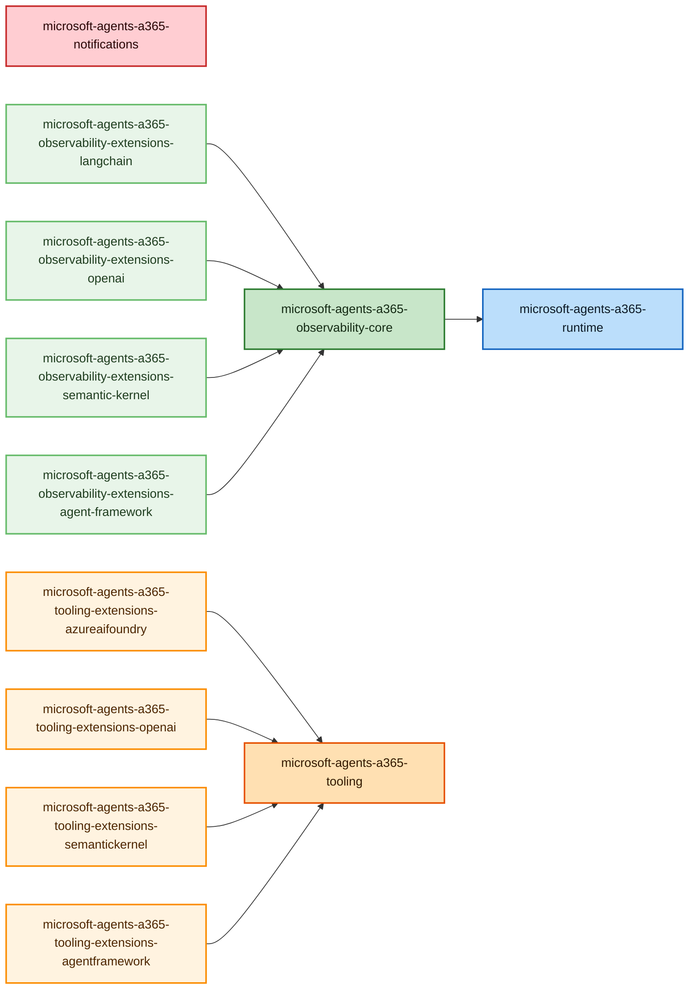

# Microsoft Agent 365 SDK Python Package Dependencies

This diagram shows the internal dependencies between Microsoft Agent 365 SDK Python packages.

## Package Types

- **Notifications** (Red): Notification and messaging extensions
- **Runtime** (Blue): Core runtime components
- **Observability** (Green): Telemetry and monitoring core
- **Observability Extensions** (Light Green): Framework-specific observability integrations
- **Tooling** (Orange): Agent tooling SDK core
- **Tooling Extensions** (Light Orange): Framework-specific tooling integrations
