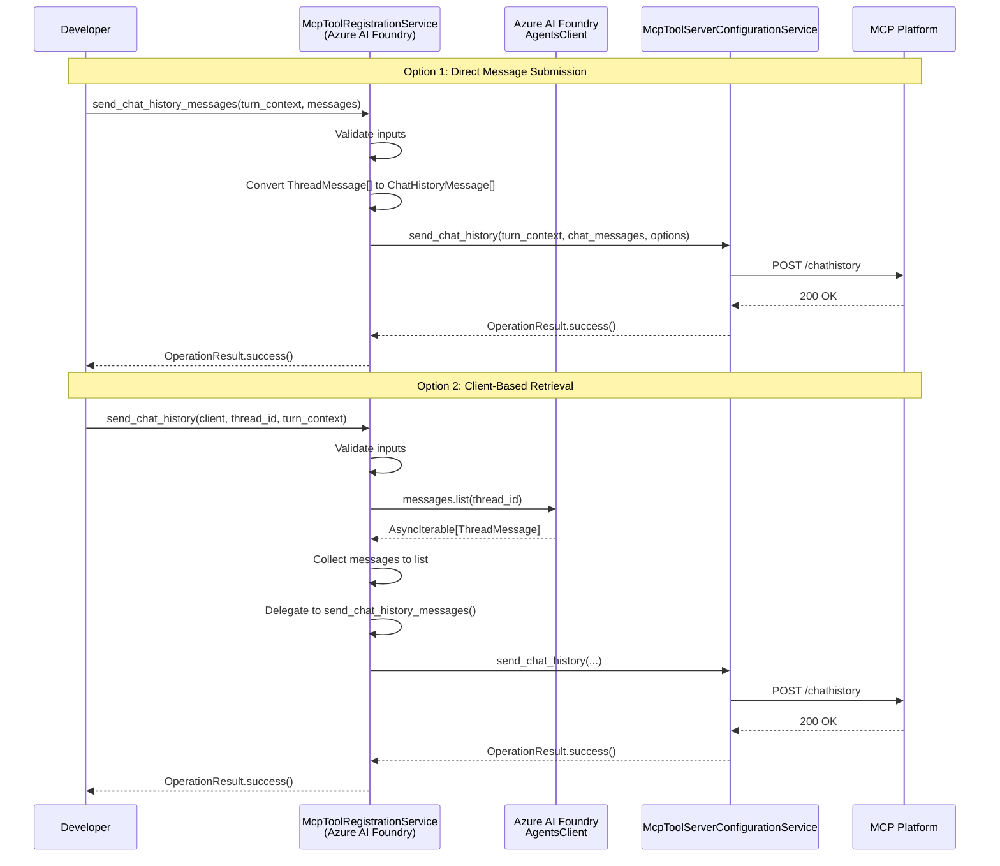
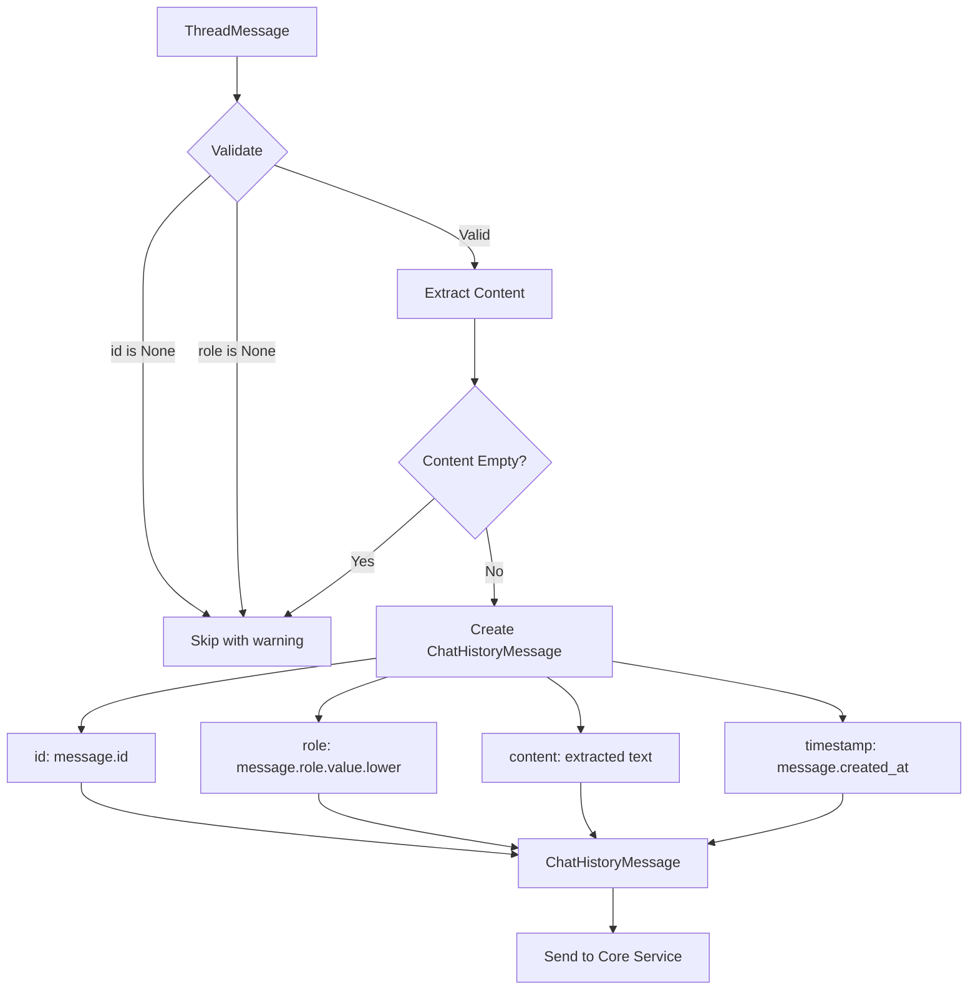

# PRD: Azure AI Foundry Chat History API

## Document Information

| Field | Value |
|-------|-------|
| **Feature Name** | Send Chat History API for Azure AI Foundry Orchestrator |
| **Package** | `microsoft-agents-a365-tooling-extensions-azureaifoundry` |
| **Version** | 0.3.0 |
| **Author** | Agent365 SDK Team |
| **Status** | Draft |
| **Created** | 2026-01-26 |
| **Last Updated** | 2026-01-26 |
| **Reference PR** | [.NET SDK PR #175](https://github.com/microsoft/Agent365-dotnet/pull/175) |

---

## 1. Overview

### 1.1 Feature Summary

This PRD describes the implementation of a chat history sending API specific to the Azure AI Foundry orchestrator in the Microsoft Agent 365 Python SDK. The feature enables developers to send conversation history from Azure AI Foundry Persistent Agents to the MCP (Model Context Protocol) platform for real-time threat protection and compliance monitoring.

### 1.2 Business Justification

- **Parity with .NET SDK**: The .NET SDK already implements this feature (PR #175), and Python SDK customers expect equivalent functionality
- **Security Compliance**: Enables real-time threat protection by forwarding chat history to the MCP platform
- **Developer Experience**: Provides a consistent API pattern across all orchestrators (OpenAI, Agent Framework, Azure AI Foundry)
- **Enterprise Readiness**: Supports enterprise security requirements for AI agent deployments in Microsoft 365 environments

### 1.3 Key Differentiator from Other Orchestrators

Unlike the OpenAI and Agent Framework chat history APIs where messages are passed directly to the method, the Azure AI Foundry implementation requires:

1. **Message Retrieval**: Messages must be retrieved from the Azure AI Foundry Persistent Agents API using a `PersistentAgentsClient`
2. **Thread-Based Access**: Messages are accessed via thread IDs rather than in-memory sessions
3. **Azure SDK Integration**: Leverages `azure-ai-agents` package for message retrieval

---

## 2. Objectives

### 2.1 Primary Objectives

| Objective | Success Criteria | Priority |
|-----------|------------------|----------|
| Implement `send_chat_history_messages()` | Method accepts Azure AI Foundry message types and sends to MCP platform | P0 |
| Implement `send_chat_history()` | Method retrieves messages from `PersistentAgentsClient` and sends to MCP platform | P0 |
| Message Conversion | Correctly convert `ThreadMessage` to `ChatHistoryMessage` format | P0 |
| API Consistency | Match patterns used in OpenAI and Agent Framework extensions | P1 |
| Full Test Coverage | Unit test coverage >= 90% | P1 |

### 2.2 Non-Goals

- Modifying the core `McpToolServerConfigurationService` class
- Adding new MCP platform endpoints
- Supporting non-persistent agent types in Azure AI Foundry
- Implementing message caching or batching

---

## 3. User Stories

### 3.1 Primary User Persona: Enterprise AI Developer

**As an** enterprise developer building AI agents with Azure AI Foundry,
**I want to** send my agent's conversation history to the MCP platform,
**So that** I can leverage real-time threat protection and ensure compliance with security policies.

### 3.2 User Story 1: Direct Message Submission

```gherkin
Given I have a list of PersistentThreadMessage objects from Azure AI Foundry
When I call send_chat_history_messages() with the messages and turn context
Then the messages are converted and sent to the MCP platform
And I receive an OperationResult indicating success or failure
```

### 3.3 User Story 2: Client-Based Message Retrieval

```gherkin
Given I have a PersistentAgentsClient and a thread ID
When I call send_chat_history() with the client, thread ID, and turn context
Then the method retrieves all messages from the thread
And converts them to ChatHistoryMessage format
And sends them to the MCP platform
And I receive an OperationResult indicating success or failure
```

### 3.4 User Story 3: Error Handling

```gherkin
Given I call send_chat_history() with an invalid thread ID
When the Azure AI Foundry API returns an error
Then I receive an OperationResult with failure status
And the error details are captured in the result
And no exception is thrown to the caller
```

---

## 4. Functional Requirements

### 4.1 API Methods

The following methods SHALL be added to the `McpToolRegistrationService` class in the Azure AI Foundry extension package:

#### 4.1.1 `send_chat_history_messages()`

Sends chat history messages directly to the MCP platform. Messages are provided by the caller.

**Signature:**
```python
async def send_chat_history_messages(
    self,
    turn_context: TurnContext,
    messages: Sequence[ThreadMessage],
    tool_options: Optional[ToolOptions] = None,
) -> OperationResult:
    """
    Send Azure AI Foundry chat history messages to the MCP platform.

    Args:
        turn_context: TurnContext from the Agents SDK containing conversation info.
        messages: Sequence of Azure AI Foundry ThreadMessage objects to send.
        tool_options: Optional configuration for the request.

    Returns:
        OperationResult indicating success or failure.

    Raises:
        ValueError: If turn_context or messages is None.
    """
```

#### 4.1.2 `send_chat_history()`

Retrieves messages from Azure AI Foundry and sends them to the MCP platform.

**Signature:**
```python
async def send_chat_history(
    self,
    agents_client: AgentsClient,
    thread_id: str,
    turn_context: TurnContext,
    tool_options: Optional[ToolOptions] = None,
) -> OperationResult:
    """
    Retrieve and send chat history from Azure AI Foundry to the MCP platform.

    Args:
        agents_client: The Azure AI Foundry AgentsClient instance.
        thread_id: The thread ID containing the messages to send.
        turn_context: TurnContext from the Agents SDK containing conversation info.
        tool_options: Optional configuration for the request.

    Returns:
        OperationResult indicating success or failure.

    Raises:
        ValueError: If agents_client, thread_id, or turn_context is None/empty.
    """
```

### 4.2 Input Validation Requirements

| Parameter | Validation Rule | Error Type |
|-----------|-----------------|------------|
| `turn_context` | Must not be None | `ValueError` |
| `messages` | Must not be None (empty list allowed) | `ValueError` |
| `agents_client` | Must not be None | `ValueError` |
| `thread_id` | Must not be None or whitespace | `ValueError` |
| `tool_options` | None allowed (uses defaults) | N/A |

### 4.3 Message Conversion Requirements

The following fields SHALL be mapped from Azure AI Foundry `ThreadMessage` to `ChatHistoryMessage`:

| Source (ThreadMessage) | Target (ChatHistoryMessage) | Transformation |
|------------------------|----------------------------|----------------|
| `id` | `id` | Direct copy (skip if None) |
| `role` | `role` | Convert enum to lowercase string ("user", "assistant", "system") |
| `content` | `content` | Extract text from `MessageContent` items |
| `created_at` | `timestamp` | Direct copy (DateTimeOffset to datetime) |

**Content Extraction Logic:**
- Iterate through `content` list
- For each `MessageTextContent` item, extract the `text.value` property
- Concatenate all text values with space separator
- Skip messages with empty/whitespace-only content (log warning)

### 4.4 Message Filtering Requirements

Messages SHALL be filtered (skipped with warning log) if:
- Message is None
- Message `id` is None
- Message `role` is None
- Extracted content is empty or whitespace-only

### 4.5 Default Behavior

| Aspect | Default Value |
|--------|---------------|
| Orchestrator Name | `"AzureAIFoundry"` |
| Empty message list | Still send request to MCP platform (registers current user message) |
| All messages filtered | Still send request to MCP platform with empty chat history |

---

## 5. Technical Requirements

### 5.1 Architecture



### 5.2 Package Dependencies

The following dependencies are required (already present in `pyproject.toml`):

```toml
dependencies = [
    "microsoft-agents-a365-tooling >= 0.0.0",
    "azure-ai-projects >= 2.0.0b1",
    "azure-ai-agents >= 1.0.0b251001",
    "azure-identity >= 1.12.0",
]
```

### 5.3 Azure AI Foundry SDK Types

The implementation SHALL use the following types from the Azure AI Agents SDK:

| Type | Package | Usage |
|------|---------|-------|
| `AgentsClient` | `azure.ai.agents` | Client for Azure AI Foundry Agents API |
| `ThreadMessage` | `azure.ai.agents.models` | Message retrieved from a thread |
| `MessageTextContent` | `azure.ai.agents.models` | Text content within a message |
| `MessageRole` | `azure.ai.agents.models` | Enum for message roles |

**Note:** The Python SDK uses `AgentsClient` and `ThreadMessage` (not `PersistentAgentsClient` and `PersistentThreadMessage` as in .NET). This is due to differences in the Azure AI SDK naming between Python and .NET.

### 5.4 Error Handling Strategy

| Error Type | Handling | Result |
|------------|----------|--------|
| `ValueError` (validation) | Re-raise to caller | Exception propagated |
| Azure SDK errors | Catch, log, wrap in `OperationError` | `OperationResult.failed()` |
| HTTP errors from MCP | Delegated to core service | `OperationResult.failed()` |
| Unexpected exceptions | Catch, log, wrap in `OperationError` | `OperationResult.failed()` |

### 5.5 Logging Requirements

| Event | Log Level | Message Template |
|-------|-----------|------------------|
| Method entry | INFO | "Sending {count} Azure AI Foundry messages as chat history" |
| Message retrieval | INFO | "Retrieved {count} messages from thread {thread_id}" |
| Message skipped (null) | WARNING | "Skipping null message" |
| Message skipped (null ID) | WARNING | "Skipping message with null ID" |
| Message skipped (null role) | WARNING | "Skipping message with null role (ID: {id})" |
| Message skipped (empty content) | WARNING | "Skipping message {id} with empty content" |
| All messages filtered | WARNING | "All messages were filtered out during conversion" |
| Success | INFO | "Chat history sent successfully with {count} messages" |
| Failure | ERROR | "Failed to send chat history: {error}" |

---

## 6. Package Impact Analysis

### 6.1 Modified Files

| File | Change Type | Description |
|------|-------------|-------------|
| `libraries/microsoft-agents-a365-tooling-extensions-azureaifoundry/microsoft_agents_a365/tooling/extensions/azureaifoundry/services/mcp_tool_registration_service.py` | Modified | Add new methods |
| `libraries/microsoft-agents-a365-tooling-extensions-azureaifoundry/microsoft_agents_a365/tooling/extensions/azureaifoundry/__init__.py` | No Change | Exports unchanged (class already exported) |

### 6.2 New Files

| File | Description |
|------|-------------|
| `tests/tooling/extensions/azureaifoundry/__init__.py` | Test package init |
| `tests/tooling/extensions/azureaifoundry/services/__init__.py` | Test services subpackage init |
| `tests/tooling/extensions/azureaifoundry/services/test_send_chat_history.py` | Unit tests for chat history API |

### 6.3 Version Impact

| Package | Current Version | New Version | Reason |
|---------|-----------------|-------------|--------|
| `microsoft-agents-a365-tooling-extensions-azureaifoundry` | 0.2.1 | 0.3.0 | New feature (minor version bump) |

---

## 7. API Design

### 7.1 Class Structure

```python
# Copyright (c) Microsoft Corporation.
# Licensed under the MIT License.

"""
MCP Tool Registration Service implementation for Azure AI Foundry.
"""

import logging
import uuid
from datetime import datetime, timezone
from typing import List, Optional, Sequence

from azure.ai.agents import AgentsClient
from azure.ai.agents.models import ThreadMessage, MessageTextContent
from microsoft_agents.hosting.core import TurnContext

from microsoft_agents_a365.runtime import OperationError, OperationResult
from microsoft_agents_a365.tooling.models import ChatHistoryMessage, ToolOptions
from microsoft_agents_a365.tooling.services.mcp_tool_server_configuration_service import (
    McpToolServerConfigurationService,
)


class McpToolRegistrationService:
    """
    Provides MCP tool registration services for Azure AI Foundry agents.
    """

    _orchestrator_name: str = "AzureAIFoundry"

    # ... existing methods ...

    # --------------------------------------------------------------------------
    # SEND CHAT HISTORY - Azure AI Foundry-specific implementations
    # --------------------------------------------------------------------------

    async def send_chat_history_messages(
        self,
        turn_context: TurnContext,
        messages: Sequence[ThreadMessage],
        tool_options: Optional[ToolOptions] = None,
    ) -> OperationResult:
        """
        Send Azure AI Foundry chat history messages to the MCP platform.

        This method accepts a sequence of Azure AI Foundry ThreadMessage objects,
        converts them to ChatHistoryMessage format, and sends them to the MCP
        platform for real-time threat protection.

        Args:
            turn_context: TurnContext from the Agents SDK containing conversation info.
            messages: Sequence of Azure AI Foundry ThreadMessage objects to send.
            tool_options: Optional configuration for the request.

        Returns:
            OperationResult indicating success or failure.

        Raises:
            ValueError: If turn_context or messages is None.

        Example:
            >>> service = McpToolRegistrationService()
            >>> messages = await agents_client.messages.list(thread_id=thread_id)
            >>> result = await service.send_chat_history_messages(
            ...     turn_context, list(messages)
            ... )
            >>> if result.succeeded:
            ...     print("Chat history sent successfully")
        """
        ...

    async def send_chat_history(
        self,
        agents_client: AgentsClient,
        thread_id: str,
        turn_context: TurnContext,
        tool_options: Optional[ToolOptions] = None,
    ) -> OperationResult:
        """
        Retrieve and send chat history from Azure AI Foundry to the MCP platform.

        This method retrieves messages from the Azure AI Foundry Agents API using
        the provided client and thread ID, converts them to ChatHistoryMessage
        format, and sends them to the MCP platform.

        Args:
            agents_client: The Azure AI Foundry AgentsClient instance.
            thread_id: The thread ID containing the messages to send.
            turn_context: TurnContext from the Agents SDK containing conversation info.
            tool_options: Optional configuration for the request.

        Returns:
            OperationResult indicating success or failure.

        Raises:
            ValueError: If agents_client, thread_id, or turn_context is None/empty.

        Example:
            >>> from azure.ai.agents import AgentsClient
            >>> from azure.identity import DefaultAzureCredential
            >>>
            >>> client = AgentsClient(endpoint, credential=DefaultAzureCredential())
            >>> service = McpToolRegistrationService()
            >>> result = await service.send_chat_history(
            ...     client, thread_id, turn_context
            ... )
        """
        ...

    # --------------------------------------------------------------------------
    # PRIVATE HELPER METHODS - Message Conversion
    # --------------------------------------------------------------------------

    def _convert_thread_messages_to_chat_history(
        self,
        messages: Sequence[ThreadMessage],
    ) -> List[ChatHistoryMessage]:
        """
        Convert Azure AI Foundry ThreadMessage objects to ChatHistoryMessage format.
        """
        ...

    def _extract_content_from_message(self, message: ThreadMessage) -> str:
        """
        Extract text content from a ThreadMessage's content items.
        """
        ...
```

### 7.2 Data Flow



---

## 8. Observability

### 8.1 Tracing

The implementation SHALL NOT add new spans. All tracing is handled by the core `McpToolServerConfigurationService.send_chat_history()` method.

### 8.2 Metrics

No new metrics are required. Existing metrics from the core service apply.

### 8.3 Logging

See Section 5.5 for logging requirements.

---

## 9. Testing Strategy

### 9.1 Unit Test Categories

| Category | Test Count | Description |
|----------|------------|-------------|
| Input Validation | 6 | Validate None checks and empty inputs |
| Message Conversion | 8 | Test ThreadMessage to ChatHistoryMessage conversion |
| Content Extraction | 5 | Test extraction from various content types |
| Success Path | 5 | Test successful operations |
| Error Handling | 6 | Test error scenarios |
| Integration Delegation | 3 | Test delegation to core service |

### 9.2 Test Structure

```
tests/tooling/extensions/azureaifoundry/
    __init__.py
    services/
        __init__.py
        test_send_chat_history.py
        conftest.py  # Fixtures for mock objects
```

### 9.3 Key Test Cases

#### 9.3.1 Input Validation Tests

```python
@pytest.mark.asyncio
@pytest.mark.unit
async def test_send_chat_history_messages_validates_turn_context_none(service):
    """Test that ValueError is raised when turn_context is None."""
    with pytest.raises(ValueError, match="turn_context cannot be None"):
        await service.send_chat_history_messages(None, [])

@pytest.mark.asyncio
@pytest.mark.unit
async def test_send_chat_history_messages_validates_messages_none(service, mock_turn_context):
    """Test that ValueError is raised when messages is None."""
    with pytest.raises(ValueError, match="messages cannot be None"):
        await service.send_chat_history_messages(mock_turn_context, None)

@pytest.mark.asyncio
@pytest.mark.unit
async def test_send_chat_history_validates_client_none(service, mock_turn_context):
    """Test that ValueError is raised when agents_client is None."""
    with pytest.raises(ValueError, match="agents_client cannot be None"):
        await service.send_chat_history(None, "thread-123", mock_turn_context)

@pytest.mark.asyncio
@pytest.mark.unit
async def test_send_chat_history_validates_thread_id_empty(
    service, mock_agents_client, mock_turn_context
):
    """Test that ValueError is raised when thread_id is empty."""
    with pytest.raises(ValueError, match="thread_id cannot be empty"):
        await service.send_chat_history(mock_agents_client, "  ", mock_turn_context)
```

#### 9.3.2 Message Conversion Tests

```python
@pytest.mark.asyncio
@pytest.mark.unit
async def test_convert_thread_message_extracts_text_content(service):
    """Test that text content is correctly extracted from ThreadMessage."""
    # Arrange
    message = create_mock_thread_message(
        id="msg-1",
        role="user",
        content=[MockMessageTextContent(text="Hello, world!")],
        created_at=datetime.now(timezone.utc)
    )

    # Act
    result = service._convert_thread_messages_to_chat_history([message])

    # Assert
    assert len(result) == 1
    assert result[0].content == "Hello, world!"
    assert result[0].role == "user"

@pytest.mark.asyncio
@pytest.mark.unit
async def test_convert_thread_message_concatenates_multiple_content_items(service):
    """Test that multiple content items are concatenated."""
    # Arrange
    message = create_mock_thread_message(
        id="msg-1",
        role="assistant",
        content=[
            MockMessageTextContent(text="Part 1"),
            MockMessageTextContent(text="Part 2"),
        ],
        created_at=datetime.now(timezone.utc)
    )

    # Act
    result = service._convert_thread_messages_to_chat_history([message])

    # Assert
    assert result[0].content == "Part 1 Part 2"
```

#### 9.3.3 Error Handling Tests

```python
@pytest.mark.asyncio
@pytest.mark.unit
async def test_send_chat_history_handles_api_error(
    service, mock_agents_client, mock_turn_context
):
    """Test that Azure API errors are caught and returned as OperationResult.failed()."""
    # Arrange
    mock_agents_client.messages.list.side_effect = Exception("API Error")

    # Act
    result = await service.send_chat_history(
        mock_agents_client, "thread-123", mock_turn_context
    )

    # Assert
    assert result.succeeded is False
    assert len(result.errors) == 1
    assert "API Error" in str(result.errors[0].message)
```

### 9.4 Mock Strategy

Use `unittest.mock` to mock Azure AI Foundry SDK types:

```python
@pytest.fixture
def mock_thread_message():
    """Create a mock ThreadMessage."""
    message = Mock()
    message.id = "msg-123"
    message.role = Mock()
    message.role.value = "user"
    message.created_at = datetime.now(timezone.utc)
    message.content = [Mock(spec=MessageTextContent)]
    message.content[0].text = Mock()
    message.content[0].text.value = "Test message"
    return message

@pytest.fixture
def mock_agents_client():
    """Create a mock AgentsClient."""
    client = Mock(spec=AgentsClient)
    client.messages = Mock()
    client.messages.list = AsyncMock(return_value=[])
    return client
```

---

## 10. Acceptance Criteria

### 10.1 Functional Acceptance Criteria

- [ ] `send_chat_history_messages()` accepts `Sequence[ThreadMessage]` and returns `OperationResult`
- [ ] `send_chat_history()` retrieves messages via `AgentsClient` and sends them
- [ ] Messages with null ID, role, or empty content are filtered with warning logs
- [ ] Empty message lists still call MCP platform (to register current user message)
- [ ] Default orchestrator name is "AzureAIFoundry"
- [ ] `ToolOptions` parameter is optional with sensible defaults
- [ ] All validation errors raise `ValueError` with descriptive messages

### 10.2 Quality Acceptance Criteria

- [ ] Unit test coverage >= 90%
- [ ] All tests pass on Python 3.11 and 3.12
- [ ] Ruff linting passes with no errors
- [ ] Type hints present on all public methods
- [ ] Docstrings follow Google style with examples
- [ ] Copyright header present on all new files

### 10.3 Documentation Acceptance Criteria

- [ ] README.md updated with chat history API examples
- [ ] Docstrings include usage examples
- [ ] API matches patterns in OpenAI and Agent Framework extensions

---

## 11. Non-Functional Requirements

### 11.1 Performance

| Metric | Requirement |
|--------|-------------|
| Message conversion | < 1ms per message |
| API call timeout | Inherit from core service (30s default) |
| Memory | No accumulation of messages beyond request scope |

### 11.2 Security

| Requirement | Implementation |
|-------------|----------------|
| No credential logging | Log message IDs only, never content |
| Token handling | Delegated to core service |
| Input sanitization | Validate all inputs before processing |

### 11.3 Compatibility

| Python Version | Support Level |
|----------------|---------------|
| 3.11 | Full support (primary) |
| 3.12 | Full support (tested in CI) |
| 3.10 and earlier | Not supported |

---

## 12. Dependencies

### 12.1 Internal Dependencies

| Package | Version | Purpose |
|---------|---------|---------|
| `microsoft-agents-a365-tooling` | >= 0.0.0 | Core tooling service |
| `microsoft-agents-a365-runtime` | >= 0.0.0 | OperationResult, OperationError |

### 12.2 External Dependencies

| Package | Version | Purpose |
|---------|---------|---------|
| `azure-ai-agents` | >= 1.0.0b251001 | Azure AI Foundry Agents SDK |
| `azure-ai-projects` | >= 2.0.0b1 | Azure AI Projects client |
| `azure-identity` | >= 1.12.0 | Azure authentication |

---

## 13. Risks and Mitigations

| Risk | Likelihood | Impact | Mitigation |
|------|------------|--------|------------|
| Azure SDK breaking changes (beta) | Medium | High | Pin minimum versions, monitor Azure SDK releases |
| Message format changes | Low | Medium | Defensive content extraction, handle unknown content types |
| Large message volumes | Medium | Low | Pagination handled by Azure SDK, no in-memory accumulation beyond single request |
| API differences between .NET and Python SDKs | Low | Medium | Use Python SDK types (`AgentsClient` vs `PersistentAgentsClient`) |

---

## 14. Open Questions

| Question | Owner | Status | Decision |
|----------|-------|--------|----------|
| Should we support message pagination/limits for `send_chat_history()`? | SDK Team | Open | TBD - Consider adding `limit` parameter in future iteration |
| Should we expose message filtering callback for custom filtering logic? | SDK Team | Open | TBD - Consider for v2 based on customer feedback |
| Should cancellation tokens be supported (like .NET)? | SDK Team | Closed | No - Python async uses different patterns; methods are already async and can be cancelled via task cancellation |

---

## 15. Implementation Checklist

### Phase 1: Core Implementation

- [ ] Add `send_chat_history_messages()` method to `McpToolRegistrationService`
- [ ] Add `send_chat_history()` method to `McpToolRegistrationService`
- [ ] Implement `_convert_thread_messages_to_chat_history()` helper
- [ ] Implement `_extract_content_from_message()` helper
- [ ] Add comprehensive logging

### Phase 2: Testing

- [ ] Create test directory structure
- [ ] Implement mock fixtures for Azure SDK types
- [ ] Write input validation tests
- [ ] Write message conversion tests
- [ ] Write success path tests
- [ ] Write error handling tests
- [ ] Verify test coverage >= 90%

### Phase 3: Documentation & Review

- [ ] Update package README.md
- [ ] Add docstrings with examples
- [ ] Run linting and type checking
- [ ] Create PR for review

---

## Appendix A: Reference Implementation (.NET)

The following code snippets from the .NET SDK PR #175 provide reference for the Python implementation:

### A.1 Interface Definition (.NET)

```csharp
Task<OperationResult> SendChatHistoryAsync(
    ITurnContext turnContext,
    PersistentThreadMessage[] messages,
    CancellationToken cancellationToken = default);

Task<OperationResult> SendChatHistoryAsync(
    PersistentAgentsClient agentClient,
    string threadId,
    ITurnContext turnContext,
    CancellationToken cancellationToken = default);
```

### A.2 Content Extraction (.NET)

```csharp
private string ExtractContentFromMessage(PersistentThreadMessage message)
{
    if (message.ContentItems == null || message.ContentItems.Count == 0)
    {
        return string.Empty;
    }

    var textContent = new System.Text.StringBuilder();

    foreach (var textContentItem in message.ContentItems.OfType<MessageTextContent>())
    {
        if (!string.IsNullOrEmpty(textContentItem.Text))
        {
            if (textContent.Length > 0)
            {
                textContent.Append(" ");
            }
            textContent.Append(textContentItem.Text);
        }
    }

    return textContent.ToString();
}
```

---

## Appendix B: Existing Python Implementations

### B.1 OpenAI Extension Pattern

```python
# From microsoft-agents-a365-tooling-extensions-openai
async def send_chat_history_messages(
    self,
    turn_context: TurnContext,
    messages: List[TResponseInputItem],
    options: Optional[ToolOptions] = None,
) -> OperationResult:
    # Validate inputs
    if turn_context is None:
        raise ValueError("turn_context cannot be None")
    if messages is None:
        raise ValueError("messages cannot be None")

    # Handle empty list as no-op
    if len(messages) == 0:
        return OperationResult.success()

    # Convert and delegate
    chat_history_messages = self._convert_openai_messages_to_chat_history(messages)
    return await self.config_service.send_chat_history(
        turn_context=turn_context,
        chat_history_messages=chat_history_messages,
        options=options,
    )
```

### B.2 Agent Framework Extension Pattern

```python
# From microsoft-agents-a365-tooling-extensions-agentframework
async def send_chat_history_from_store(
    self,
    chat_message_store: ChatMessageStoreProtocol,
    turn_context: TurnContext,
    tool_options: Optional[ToolOptions] = None,
) -> OperationResult:
    if chat_message_store is None:
        raise ValueError("chat_message_store cannot be None")
    if turn_context is None:
        raise ValueError("turn_context cannot be None")

    messages = await chat_message_store.list_messages()
    return await self.send_chat_history_messages(
        chat_messages=messages,
        turn_context=turn_context,
        tool_options=tool_options,
    )
```
