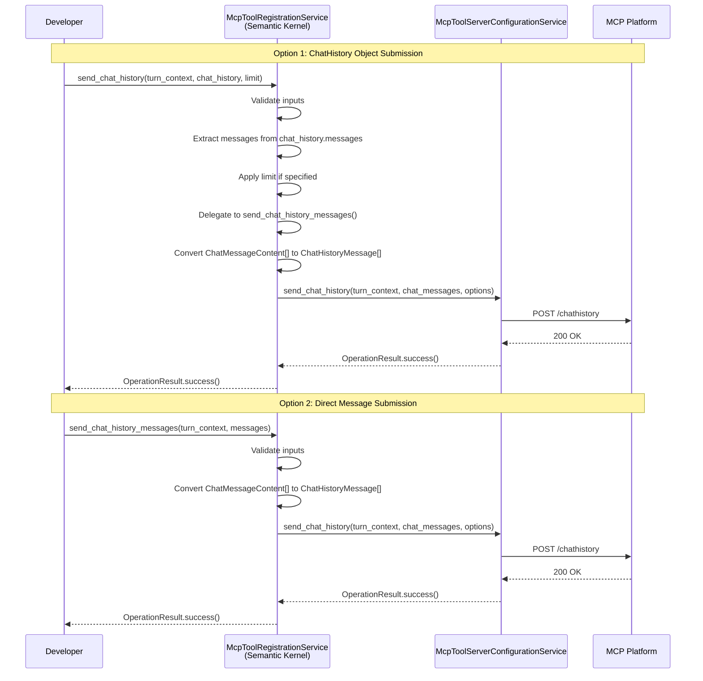
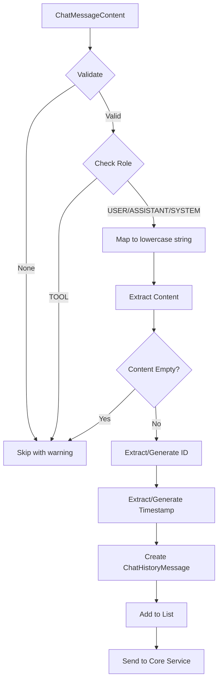

# PRD: Semantic Kernel Chat History API

## Document Information

| Field | Value |
|-------|-------|
| **Feature Name** | Send Chat History API for Semantic Kernel Orchestrator |
| **Package** | `microsoft-agents-a365-tooling-extensions-semantickernel` |
| **Version** | 1.1.0 |
| **Author** | Agent365 SDK Team |
| **Status** | Draft |
| **Created** | 2026-01-28 |
| **Last Updated** | 2026-01-28 |
| **Reference PR** | [.NET SDK PR #173](https://github.com/microsoft/Agent365-dotnet/pull/173) |

---

## 1. Overview

### 1.1 Feature Summary

This PRD describes the implementation of a chat history sending API specific to the Semantic Kernel orchestrator in the Microsoft Agent 365 Python SDK. The feature enables developers to send conversation history from Semantic Kernel agents to the MCP (Model Context Protocol) platform for real-time threat protection and compliance monitoring.

### 1.2 Business Justification

- **Parity with .NET SDK**: The .NET SDK already implements this feature (PR #173), and Python SDK customers expect equivalent functionality
- **Security Compliance**: Enables real-time threat protection by forwarding chat history to the MCP platform
- **Developer Experience**: Provides a consistent API pattern across all orchestrators (OpenAI, Azure AI Foundry, Semantic Kernel)
- **Enterprise Readiness**: Supports enterprise security requirements for AI agent deployments in Microsoft 365 environments
- **Framework Completeness**: Semantic Kernel is a widely-used AI orchestration framework, and having full parity with other supported orchestrators is critical

### 1.3 Key Differentiator from Other Orchestrators

Unlike the Azure AI Foundry chat history API which requires retrieving messages from a remote Persistent Agents API, the Semantic Kernel implementation works with:

1. **In-Memory ChatHistory**: Semantic Kernel manages conversation history in a `ChatHistory` object
2. **Direct Message Access**: Messages are accessed via the `messages` property which returns `List[ChatMessageContent]`
3. **AuthorRole Enum**: Uses `AuthorRole` enum (`USER`, `ASSISTANT`, `SYSTEM`, `TOOL`) instead of string roles
4. **Semantic Kernel SDK Types**: Leverages `semantic-kernel` package types for message handling

---

## 2. Objectives

### 2.1 Primary Objectives

| Objective | Success Criteria | Priority |
|-----------|------------------|----------|
| Implement `send_chat_history()` | Method accepts Semantic Kernel `ChatHistory` object and sends to MCP platform | P0 |
| Implement `send_chat_history_messages()` | Method accepts `Sequence[ChatMessageContent]` and sends to MCP platform | P0 |
| Message Conversion | Correctly convert `ChatMessageContent` to `ChatHistoryMessage` format | P0 |
| AuthorRole Mapping | Convert `AuthorRole` enum values to lowercase strings | P0 |
| API Consistency | Match patterns used in OpenAI extension | P1 |
| Full Test Coverage | Unit test coverage >= 90% | P1 |

### 2.2 Non-Goals

- Modifying the core `McpToolServerConfigurationService` class
- Adding new MCP platform endpoints
- Supporting streaming chat history scenarios
- Implementing message caching or batching
- Modifying the existing `add_tool_servers_to_agent()` or `cleanup_connections()` methods

---

## 3. User Stories

### 3.1 Primary User Persona: Enterprise AI Developer

**As an** enterprise developer building AI agents with Semantic Kernel,
**I want to** send my agent's conversation history to the MCP platform,
**So that** I can leverage real-time threat protection and ensure compliance with security policies.

### 3.2 User Story 1: ChatHistory Object Submission

```gherkin
Given I have a Semantic Kernel ChatHistory object with conversation messages
When I call send_chat_history() with the ChatHistory object and turn context
Then the messages are converted from ChatMessageContent to ChatHistoryMessage format
And the messages are sent to the MCP platform
And I receive an OperationResult indicating success or failure
```

### 3.3 User Story 2: Direct Message List Submission

```gherkin
Given I have a list of ChatMessageContent objects from my Semantic Kernel agent
When I call send_chat_history_messages() with the messages and turn context
Then the messages are converted and sent to the MCP platform
And I receive an OperationResult indicating success or failure
```

### 3.4 User Story 3: Handling All Semantic Kernel Roles

```gherkin
Given I have a ChatHistory containing messages with various roles (USER, ASSISTANT, SYSTEM, TOOL)
When I call send_chat_history() with the ChatHistory
Then all roles are converted to their lowercase string equivalents ("user", "assistant", "system", "tool")
And all valid messages are sent to the MCP platform
And I receive an OperationResult indicating success or failure
```

### 3.5 User Story 4: Error Handling

```gherkin
Given I call send_chat_history() with a None ChatHistory object
When the validation is performed
Then a ValueError is raised with a descriptive message
And the exception clearly indicates what parameter was invalid
```

### 3.6 User Story 5: Message Limit Support

```gherkin
Given I have a ChatHistory with 100 messages
When I call send_chat_history() with a limit of 10
Then only the last 10 messages are sent to the MCP platform
And I receive an OperationResult indicating success
```

---

## 4. Functional Requirements

### 4.1 API Methods

The following methods SHALL be added to the `McpToolRegistrationService` class in the Semantic Kernel extension package:

#### 4.1.1 `send_chat_history()`

Sends chat history from a Semantic Kernel ChatHistory object to the MCP platform.

**Signature:**
```python
async def send_chat_history(
    self,
    turn_context: TurnContext,
    chat_history: ChatHistory,
    limit: Optional[int] = None,
    options: Optional[ToolOptions] = None,
) -> OperationResult:
    """
    Send Semantic Kernel chat history to the MCP platform.

    This method extracts messages from a Semantic Kernel ChatHistory object,
    converts them to ChatHistoryMessage format, and sends them to the MCP
    platform for real-time threat protection.

    Args:
        turn_context: TurnContext from the Agents SDK containing conversation info.
        chat_history: Semantic Kernel ChatHistory object containing messages.
        limit: Optional maximum number of messages to send. If specified,
               sends the most recent N messages. If None, sends all messages.
        options: Optional configuration for the request.

    Returns:
        OperationResult indicating success or failure.

    Raises:
        ValueError: If turn_context or chat_history is None.

    Example:
        >>> from semantic_kernel.contents import ChatHistory
        >>> from microsoft_agents_a365.tooling.extensions.semantickernel import (
        ...     McpToolRegistrationService
        ... )
        >>>
        >>> service = McpToolRegistrationService()
        >>> chat_history = ChatHistory()
        >>> chat_history.add_user_message("Hello!")
        >>> chat_history.add_assistant_message("Hi there!")
        >>>
        >>> result = await service.send_chat_history(
        ...     turn_context, chat_history, limit=50
        ... )
        >>> if result.succeeded:
        ...     print("Chat history sent successfully")
    """
```

#### 4.1.2 `send_chat_history_messages()`

Sends chat history messages directly to the MCP platform. Messages are provided by the caller.

**Signature:**
```python
async def send_chat_history_messages(
    self,
    turn_context: TurnContext,
    messages: Sequence[ChatMessageContent],
    options: Optional[ToolOptions] = None,
) -> OperationResult:
    """
    Send Semantic Kernel chat history messages to the MCP platform.

    This method accepts a sequence of Semantic Kernel ChatMessageContent objects,
    converts them to ChatHistoryMessage format, and sends them to the MCP
    platform for real-time threat protection.

    Args:
        turn_context: TurnContext from the Agents SDK containing conversation info.
        messages: Sequence of Semantic Kernel ChatMessageContent objects to send.
        options: Optional configuration for the request.

    Returns:
        OperationResult indicating success or failure.

    Raises:
        ValueError: If turn_context or messages is None.

    Example:
        >>> from semantic_kernel.contents import ChatMessageContent, AuthorRole
        >>> from microsoft_agents_a365.tooling.extensions.semantickernel import (
        ...     McpToolRegistrationService
        ... )
        >>>
        >>> service = McpToolRegistrationService()
        >>> messages = [
        ...     ChatMessageContent(role=AuthorRole.USER, content="Hello!"),
        ...     ChatMessageContent(role=AuthorRole.ASSISTANT, content="Hi there!"),
        ... ]
        >>>
        >>> result = await service.send_chat_history_messages(
        ...     turn_context, messages
        ... )
        >>> if result.succeeded:
        ...     print("Chat history sent successfully")
    """
```

### 4.2 Input Validation Requirements

| Parameter | Validation Rule | Error Type |
|-----------|-----------------|------------|
| `turn_context` | Must not be None | `ValueError` |
| `chat_history` | Must not be None | `ValueError` |
| `messages` | Must not be None (empty sequence allowed and will still be sent to MCP platform) | `ValueError` |
| `limit` | None allowed (retrieves all); if provided, must be positive | N/A |
| `options` | None allowed (uses defaults) | N/A |

### 4.3 Message Conversion Requirements

The following fields SHALL be mapped from Semantic Kernel `ChatMessageContent` to `ChatHistoryMessage`:

| Source (ChatMessageContent) | Target (ChatHistoryMessage) | Transformation |
|-----------------------------|----------------------------|----------------|
| `metadata.get("id")` or generated UUID | `id` | Extract from metadata or generate UUID |
| `role` | `role` | Convert AuthorRole enum to lowercase string |
| `content` | `content` | Direct copy (must be string type and non-empty) |
| `metadata.get("timestamp")` or current UTC | `timestamp` | Extract from metadata or use current UTC time |

**Security Note**: The `content` field MUST be a string type. If `content` is an unexpected type (not `str` or `None`), the method SHALL return empty string and log a warning. This prevents unintentionally exposing sensitive data that might be present in an object's `__str__` or `__repr__` methods.

### 4.4 Message Filtering Requirements

Messages SHALL be filtered (skipped with warning log) if they are **invalid**:

| Condition | Reason | Log Message |
|-----------|--------|-------------|
| Message is `None` | Cannot process null message | "Skipping null message at index {index}" |
| Message `content` is None, empty, or whitespace-only | Content is required for chat history | "Skipping message at index {index} with empty content" |
| Message `content` is unexpected type (not `str`) | Security: prevent data exposure from object stringification | "Unexpected content type '{type}' encountered. Returning empty string to avoid potential data exposure." |

### 4.5 Default Behavior

| Aspect | Default Value |
|--------|---------------|
| Orchestrator Name | `"SemanticKernel"` |
| Empty message list | Still send request to MCP platform (registers current user message) |
| All messages filtered | Still send request to MCP platform with empty chat history |
| Message ID not present | Generate new UUID |
| Timestamp not present | Use current UTC datetime |

---

## 5. Technical Requirements

### 5.1 Architecture



### 5.2 Package Dependencies

The following dependencies are required (already present in `pyproject.toml`):

```toml
dependencies = [
    "microsoft-agents-a365-tooling >= 0.0.0",
    "semantic-kernel >= 1.0.0",
    "aiohttp >= 3.8.0",
]
```

### 5.3 Semantic Kernel SDK Types

The implementation SHALL use the following types from the Semantic Kernel SDK:

| Type | Package | Usage |
|------|---------|-------|
| `ChatHistory` | `semantic_kernel.contents` | Container for conversation messages |
| `ChatMessageContent` | `semantic_kernel.contents` | Individual message in chat history |
| `AuthorRole` | `semantic_kernel.contents` | Enum for message roles (USER, ASSISTANT, SYSTEM, TOOL) |

### 5.4 Error Handling Strategy

| Error Type | Handling | Result |
|------------|----------|--------|
| `ValueError` (validation) | Re-raise to caller | Exception propagated |
| Conversion errors | Catch, log, skip message | Message filtered, operation continues |
| HTTP errors from MCP | Delegated to core service | `OperationResult.failed()` |
| Unexpected exceptions | Catch, log, wrap in `OperationError` | `OperationResult.failed()` |

### 5.5 Logging Requirements

| Event | Log Level | Message Template |
|-------|-----------|------------------|
| Method entry | INFO | "Sending {count} Semantic Kernel messages as chat history" |
| Message extraction | DEBUG | "Extracted {count} messages from ChatHistory" |
| Limit applied | INFO | "Applying limit of {limit} to {total} messages" |
| Message skipped (null) | WARNING | "Skipping null message at index {index}" |
| Message skipped (empty content) | WARNING | "Skipping message at index {index} with empty content" |
| Unexpected content type | WARNING | "Unexpected content type '{type}' encountered. Returning empty string to avoid potential data exposure." |
| All messages filtered | WARNING | "All messages were filtered out during conversion" |
| ID generated | DEBUG | "Generated UUID {id} for message at index {index}" |
| Timestamp generated | DEBUG | "Using current UTC time for message at index {index}" |
| Success | INFO | "Chat history sent successfully with {count} messages" |
| Failure | ERROR | "Failed to send chat history: {error}" |

---

## 6. Package Impact Analysis

### 6.1 Modified Files

| File | Change Type | Description |
|------|-------------|-------------|
| `libraries/microsoft-agents-a365-tooling-extensions-semantickernel/microsoft_agents_a365/tooling/extensions/semantickernel/services/mcp_tool_registration_service.py` | Modified | Add new chat history methods |
| `libraries/microsoft-agents-a365-tooling-extensions-semantickernel/microsoft_agents_a365/tooling/extensions/semantickernel/__init__.py` | No Change | Exports unchanged (class already exported) |

### 6.2 New Files

| File | Description |
|------|-------------|
| `tests/tooling/extensions/semantickernel/__init__.py` | Test package init |
| `tests/tooling/extensions/semantickernel/services/__init__.py` | Test services subpackage init |
| `tests/tooling/extensions/semantickernel/services/test_send_chat_history.py` | Unit tests for chat history API |
| `tests/tooling/extensions/semantickernel/services/conftest.py` | Fixtures for mock objects |

### 6.3 Version Impact

| Package | Current Version | New Version | Reason |
|---------|-----------------|-------------|--------|
| `microsoft-agents-a365-tooling-extensions-semantickernel` | 1.0.0 | 1.1.0 | New feature (minor version bump) |

---

## 7. API Design

### 7.1 Class Structure

```python
# Copyright (c) Microsoft Corporation.
# Licensed under the MIT License.

"""
MCP Tool Registration Service implementation for Semantic Kernel.
"""

import logging
import uuid
from datetime import datetime, timezone
from typing import List, Optional, Sequence

from semantic_kernel.contents import AuthorRole, ChatHistory, ChatMessageContent
from microsoft_agents.hosting.core import TurnContext

from microsoft_agents_a365.runtime import OperationError, OperationResult
from microsoft_agents_a365.tooling.models import ChatHistoryMessage, ToolOptions
from microsoft_agents_a365.tooling.services.mcp_tool_server_configuration_service import (
    McpToolServerConfigurationService,
)


class McpToolRegistrationService:
    """
    Provides MCP tool registration services for Semantic Kernel agents.
    """

    _orchestrator_name: str = "SemanticKernel"

    # ... existing __init__, add_tool_servers_to_agent, cleanup_connections methods ...

    # --------------------------------------------------------------------------
    # SEND CHAT HISTORY - Semantic Kernel-specific implementations
    # --------------------------------------------------------------------------

    async def send_chat_history(
        self,
        turn_context: TurnContext,
        chat_history: ChatHistory,
        limit: Optional[int] = None,
        options: Optional[ToolOptions] = None,
    ) -> OperationResult:
        """
        Send Semantic Kernel chat history to the MCP platform.

        ... (docstring as defined in 4.1.1) ...
        """
        # Validate inputs
        if turn_context is None:
            raise ValueError("turn_context cannot be None")
        if chat_history is None:
            raise ValueError("chat_history cannot be None")

        try:
            # Extract messages from ChatHistory
            messages = list(chat_history.messages)
            self._logger.debug(f"Extracted {len(messages)} messages from ChatHistory")

            # Apply limit if specified
            if limit is not None and limit > 0 and len(messages) > limit:
                self._logger.info(f"Applying limit of {limit} to {len(messages)} messages")
                messages = messages[-limit:]  # Take the most recent N messages

            # Delegate to the list-based method
            return await self.send_chat_history_messages(
                turn_context=turn_context,
                messages=messages,
                options=options,
            )
        except ValueError:
            # Re-raise validation errors
            raise
        except Exception as ex:
            self._logger.error(f"Failed to send chat history: {ex}")
            return OperationResult.failed(OperationError(ex))

    async def send_chat_history_messages(
        self,
        turn_context: TurnContext,
        messages: Sequence[ChatMessageContent],
        options: Optional[ToolOptions] = None,
    ) -> OperationResult:
        """
        Send Semantic Kernel chat history messages to the MCP platform.

        ... (docstring as defined in 4.1.2) ...
        """
        # Validate inputs
        if turn_context is None:
            raise ValueError("turn_context cannot be None")
        if messages is None:
            raise ValueError("messages cannot be None")

        self._logger.info(f"Sending {len(messages)} Semantic Kernel messages as chat history")

        # Set default options
        if options is None:
            options = ToolOptions(orchestrator_name=self._orchestrator_name)
        elif options.orchestrator_name is None:
            options.orchestrator_name = self._orchestrator_name

        try:
            # Convert Semantic Kernel messages to ChatHistoryMessage format
            chat_history_messages = self._convert_sk_messages_to_chat_history(messages)

            # Call core service even with empty chat_history_messages
            if len(chat_history_messages) == 0:
                self._logger.info(
                    "Empty chat history messages (either no input or all filtered), "
                    "still sending to register user message"
                )

            self._logger.debug(
                f"Converted {len(chat_history_messages)} messages to ChatHistoryMessage format"
            )

            # Delegate to core service
            return await self._mcp_server_configuration_service.send_chat_history(
                turn_context=turn_context,
                chat_history_messages=chat_history_messages,
                options=options,
            )
        except ValueError:
            # Re-raise validation errors from the core service
            raise
        except Exception as ex:
            self._logger.error(f"Failed to send chat history messages: {ex}")
            return OperationResult.failed(OperationError(ex))

    # --------------------------------------------------------------------------
    # PRIVATE HELPER METHODS - Message Conversion
    # --------------------------------------------------------------------------

    def _convert_sk_messages_to_chat_history(
        self,
        messages: Sequence[ChatMessageContent],
    ) -> List[ChatHistoryMessage]:
        """
        Convert Semantic Kernel ChatMessageContent objects to ChatHistoryMessage format.

        Args:
            messages: Sequence of Semantic Kernel ChatMessageContent objects.

        Returns:
            List of ChatHistoryMessage objects. Messages that cannot be converted
            are filtered out with a warning log.
        """
        chat_history_messages: List[ChatHistoryMessage] = []

        for idx, message in enumerate(messages):
            converted = self._convert_single_sk_message(message, idx)
            if converted is not None:
                chat_history_messages.append(converted)

        self._logger.info(
            f"Converted {len(chat_history_messages)} of {len(messages)} messages "
            "to ChatHistoryMessage format"
        )
        return chat_history_messages

    def _convert_single_sk_message(
        self,
        message: ChatMessageContent,
        index: int = 0,
    ) -> Optional[ChatHistoryMessage]:
        """
        Convert a single Semantic Kernel message to ChatHistoryMessage format.

        Args:
            message: Single Semantic Kernel ChatMessageContent message.
            index: Index of the message in the list (for logging).

        Returns:
            ChatHistoryMessage object or None if conversion fails.
        """
        try:
            # Skip None messages
            if message is None:
                self._logger.warning(f"Skipping null message at index {index}")
                return None

            # Map role to string
            role = self._map_author_role(message.role)

            # Extract content
            content = self._extract_content(message)
            if not content or not content.strip():
                self._logger.warning(f"Skipping message at index {index} with empty content")
                return None

            # Extract or generate ID
            msg_id = self._extract_or_generate_id(message, index)

            # Extract or generate timestamp
            timestamp = self._extract_or_generate_timestamp(message, index)

            self._logger.debug(
                f"Converting message {index}: role={role}, "
                f"id={msg_id}, has_timestamp={timestamp is not None}"
            )

            return ChatHistoryMessage(
                id=msg_id,
                role=role,
                content=content,
                timestamp=timestamp,
            )
        except Exception as ex:
            self._logger.error(f"Failed to convert message at index {index}: {ex}")
            return None

    def _map_author_role(self, role: AuthorRole) -> str:
        """
        Map Semantic Kernel AuthorRole enum to lowercase string.

        Args:
            role: AuthorRole enum value.

        Returns:
            Lowercase string representation of the role.
        """
        return role.name.lower()

    def _extract_content(self, message: ChatMessageContent) -> str:
        """
        Extract text content from a ChatMessageContent.

        Args:
            message: Semantic Kernel ChatMessageContent object.

        Returns:
            Content string (may be empty).
        """
        if message.content is None:
            return ""
        return str(message.content)

    def _extract_or_generate_id(
        self,
        message: ChatMessageContent,
        index: int,
    ) -> str:
        """
        Extract message ID from metadata or generate a new UUID.

        Args:
            message: Semantic Kernel ChatMessageContent object.
            index: Message index for logging.

        Returns:
            Message ID string.
        """
        # Try to get existing ID from metadata
        if message.metadata and "id" in message.metadata:
            existing_id = message.metadata["id"]
            if existing_id:
                return str(existing_id)

        # Generate new UUID
        generated_id = str(uuid.uuid4())
        self._logger.debug(f"Generated UUID {generated_id} for message at index {index}")
        return generated_id

    def _extract_or_generate_timestamp(
        self,
        message: ChatMessageContent,
        index: int,
    ) -> datetime:
        """
        Extract timestamp from metadata or generate current UTC time.

        Args:
            message: Semantic Kernel ChatMessageContent object.
            index: Message index for logging.

        Returns:
            Timestamp as datetime object.
        """
        # Try to get existing timestamp from metadata
        if message.metadata:
            existing_timestamp = message.metadata.get("timestamp") or message.metadata.get("created_at")
            if existing_timestamp:
                if isinstance(existing_timestamp, datetime):
                    return existing_timestamp
                elif isinstance(existing_timestamp, (int, float)):
                    # Unix timestamp
                    return datetime.fromtimestamp(existing_timestamp, tz=timezone.utc)
                elif isinstance(existing_timestamp, str):
                    try:
                        return datetime.fromisoformat(existing_timestamp.replace("Z", "+00:00"))
                    except ValueError:
                        pass

        # Use current UTC time
        self._logger.debug(f"Using current UTC time for message at index {index}")
        return datetime.now(timezone.utc)
```

### 7.2 Data Flow



---

## 8. Observability

### 8.1 Tracing

The implementation SHALL NOT add new spans. All tracing is handled by the core `McpToolServerConfigurationService.send_chat_history()` method.

### 8.2 Metrics

No new metrics are required. Existing metrics from the core service apply.

### 8.3 Logging

See Section 5.5 for logging requirements.

---

## 9. Testing Strategy

### 9.1 Unit Test Categories

| Category | Test Count | Description |
|----------|------------|-------------|
| Input Validation | 6 | Validate None checks and empty inputs |
| Message Conversion | 10 | Test ChatMessageContent to ChatHistoryMessage conversion |
| Role Mapping | 1 | Test AuthorRole enum to lowercase string conversion (parameterized) |
| Limit Functionality | 4 | Test message limit behavior |
| Success Path | 5 | Test successful operations |
| Error Handling | 6 | Test error scenarios |
| Integration Delegation | 3 | Test delegation to core service |

### 9.2 Test Structure

```
tests/tooling/extensions/semantickernel/
    __init__.py
    services/
        __init__.py
        test_send_chat_history.py
        conftest.py  # Fixtures for mock objects
```

### 9.3 Key Test Cases

#### 9.3.1 Input Validation Tests

```python
@pytest.mark.asyncio
@pytest.mark.unit
async def test_send_chat_history_validates_turn_context_none(service):
    """Test that ValueError is raised when turn_context is None."""
    chat_history = ChatHistory()
    with pytest.raises(ValueError, match="turn_context cannot be None"):
        await service.send_chat_history(None, chat_history)

@pytest.mark.asyncio
@pytest.mark.unit
async def test_send_chat_history_validates_chat_history_none(service, mock_turn_context):
    """Test that ValueError is raised when chat_history is None."""
    with pytest.raises(ValueError, match="chat_history cannot be None"):
        await service.send_chat_history(mock_turn_context, None)

@pytest.mark.asyncio
@pytest.mark.unit
async def test_send_chat_history_messages_validates_turn_context_none(service):
    """Test that ValueError is raised when turn_context is None."""
    with pytest.raises(ValueError, match="turn_context cannot be None"):
        await service.send_chat_history_messages(None, [])

@pytest.mark.asyncio
@pytest.mark.unit
async def test_send_chat_history_messages_validates_messages_none(service, mock_turn_context):
    """Test that ValueError is raised when messages is None."""
    with pytest.raises(ValueError, match="messages cannot be None"):
        await service.send_chat_history_messages(mock_turn_context, None)
```

#### 9.3.2 Role Mapping Tests

```python
@pytest.mark.unit
@pytest.mark.parametrize("role,expected", [
    (AuthorRole.USER, "user"),
    (AuthorRole.ASSISTANT, "assistant"),
    (AuthorRole.SYSTEM, "system"),
    (AuthorRole.TOOL, "tool"),
])
def test_map_author_role_converts_to_lowercase(service, role, expected):
    """Test that AuthorRole enum values are converted to lowercase strings."""
    result = service._map_author_role(role)
    assert result == expected
```

#### 9.3.3 Message Conversion Tests

```python
@pytest.mark.asyncio
@pytest.mark.unit
async def test_convert_single_sk_message_user_message(service):
    """Test converting a user message."""
    message = ChatMessageContent(
        role=AuthorRole.USER,
        content="Hello, world!",
        metadata={"id": "msg-1", "timestamp": datetime.now(timezone.utc)}
    )

    result = service._convert_single_sk_message(message, 0)

    assert result is not None
    assert result.role == "user"
    assert result.content == "Hello, world!"
    assert result.id == "msg-1"

@pytest.mark.asyncio
@pytest.mark.unit
async def test_convert_single_sk_message_skips_empty_content(service):
    """Test that messages with empty content are skipped."""
    message = ChatMessageContent(
        role=AuthorRole.USER,
        content="   ",
    )

    result = service._convert_single_sk_message(message, 0)

    assert result is None

@pytest.mark.asyncio
@pytest.mark.unit
async def test_convert_single_sk_message_generates_id_when_missing(service):
    """Test that UUID is generated when message has no ID in metadata."""
    message = ChatMessageContent(
        role=AuthorRole.USER,
        content="Hello!",
    )

    result = service._convert_single_sk_message(message, 0)

    assert result is not None
    assert result.id is not None
    # Verify it's a valid UUID format
    uuid.UUID(result.id)

@pytest.mark.asyncio
@pytest.mark.unit
async def test_convert_single_sk_message_generates_timestamp_when_missing(service):
    """Test that current UTC time is used when timestamp is missing."""
    message = ChatMessageContent(
        role=AuthorRole.ASSISTANT,
        content="Hi there!",
    )
    before = datetime.now(timezone.utc)

    result = service._convert_single_sk_message(message, 0)

    after = datetime.now(timezone.utc)
    assert result is not None
    assert before <= result.timestamp <= after
```

#### 9.3.4 Limit Functionality Tests

```python
@pytest.mark.asyncio
@pytest.mark.unit
async def test_send_chat_history_applies_limit(
    service, mock_turn_context, mock_config_service
):
    """Test that limit parameter restricts messages sent."""
    chat_history = ChatHistory()
    for i in range(10):
        chat_history.add_user_message(f"Message {i}")

    mock_config_service.send_chat_history.return_value = OperationResult.success()

    result = await service.send_chat_history(
        mock_turn_context, chat_history, limit=3
    )

    assert result.succeeded
    # Verify only 3 messages were sent (the most recent)
    call_args = mock_config_service.send_chat_history.call_args
    sent_messages = call_args.kwargs["chat_history_messages"]
    assert len(sent_messages) == 3

@pytest.mark.asyncio
@pytest.mark.unit
async def test_send_chat_history_no_limit_sends_all(
    service, mock_turn_context, mock_config_service
):
    """Test that no limit sends all messages."""
    chat_history = ChatHistory()
    for i in range(5):
        chat_history.add_user_message(f"Message {i}")

    mock_config_service.send_chat_history.return_value = OperationResult.success()

    result = await service.send_chat_history(
        mock_turn_context, chat_history
    )

    assert result.succeeded
    call_args = mock_config_service.send_chat_history.call_args
    sent_messages = call_args.kwargs["chat_history_messages"]
    assert len(sent_messages) == 5
```

#### 9.3.5 Error Handling Tests

```python
@pytest.mark.asyncio
@pytest.mark.unit
async def test_send_chat_history_handles_conversion_error(
    service, mock_turn_context, mock_config_service
):
    """Test that conversion errors are handled gracefully."""
    chat_history = ChatHistory()
    chat_history.add_user_message("Valid message")

    # Mock to raise an unexpected error
    mock_config_service.send_chat_history.side_effect = Exception("Unexpected error")

    result = await service.send_chat_history(mock_turn_context, chat_history)

    assert result.succeeded is False
    assert len(result.errors) == 1

@pytest.mark.asyncio
@pytest.mark.unit
async def test_send_chat_history_messages_handles_core_service_failure(
    service, mock_turn_context, mock_config_service
):
    """Test that core service failures are returned as OperationResult.failed()."""
    messages = [
        ChatMessageContent(role=AuthorRole.USER, content="Hello")
    ]

    mock_config_service.send_chat_history.return_value = OperationResult.failed(
        OperationError(Exception("MCP platform error"))
    )

    result = await service.send_chat_history_messages(mock_turn_context, messages)

    assert result.succeeded is False
```

### 9.4 Mock Strategy

Use `unittest.mock` to mock Semantic Kernel SDK types:

```python
@pytest.fixture
def mock_chat_message_content():
    """Create a mock ChatMessageContent."""
    def _create(role=AuthorRole.USER, content="Test message", metadata=None):
        message = Mock(spec=ChatMessageContent)
        message.role = role
        message.content = content
        message.metadata = metadata or {}
        return message
    return _create

@pytest.fixture
def mock_chat_history(mock_chat_message_content):
    """Create a mock ChatHistory."""
    def _create(messages=None):
        if messages is None:
            messages = [
                mock_chat_message_content(AuthorRole.USER, "Hello"),
                mock_chat_message_content(AuthorRole.ASSISTANT, "Hi there!"),
            ]
        history = Mock(spec=ChatHistory)
        history.messages = messages
        return history
    return _create

@pytest.fixture
def mock_turn_context():
    """Create a mock TurnContext."""
    context = Mock(spec=TurnContext)
    context.activity = Mock()
    context.activity.conversation = Mock()
    context.activity.conversation.id = "conv-123"
    context.activity.id = "msg-456"
    context.activity.text = "User message"
    return context

@pytest.fixture
def mock_config_service():
    """Create a mock McpToolServerConfigurationService."""
    service = AsyncMock(spec=McpToolServerConfigurationService)
    service.send_chat_history = AsyncMock(return_value=OperationResult.success())
    return service

@pytest.fixture
def service(mock_config_service):
    """Create McpToolRegistrationService with mocked dependencies."""
    svc = McpToolRegistrationService()
    svc._mcp_server_configuration_service = mock_config_service
    return svc
```

---

## 10. Acceptance Criteria

### 10.1 Functional Acceptance Criteria

- [ ] `send_chat_history()` accepts `ChatHistory` object and returns `OperationResult`
- [ ] `send_chat_history_messages()` accepts `Sequence[ChatMessageContent]` and returns `OperationResult`
- [ ] `AuthorRole` enum values are converted to lowercase strings (e.g., `AuthorRole.USER` → `"user"`)
- [ ] Messages with empty content are filtered with warning logs
- [ ] Empty message lists still call MCP platform (to register current user message)
- [ ] `limit` parameter correctly restricts messages to most recent N
- [ ] Default orchestrator name is `"SemanticKernel"`
- [ ] `ToolOptions` parameter is optional with sensible defaults
- [ ] All validation errors raise `ValueError` with descriptive messages
- [ ] Message IDs are extracted from metadata or generated as UUIDs
- [ ] Timestamps are extracted from metadata or generated as current UTC time

### 10.2 Quality Acceptance Criteria

- [ ] Unit test coverage >= 90%
- [ ] All tests pass on Python 3.11 and 3.12
- [ ] Ruff linting passes with no errors
- [ ] Type hints present on all public methods
- [ ] Docstrings follow Google style with examples
- [ ] Copyright header present on all new files

### 10.3 Documentation Acceptance Criteria

- [ ] Package design.md updated with chat history API examples
- [ ] Docstrings include usage examples
- [ ] API matches patterns in OpenAI extension

---

## 11. Non-Functional Requirements

### 11.1 Performance

| Metric | Requirement |
|--------|-------------|
| Message conversion | < 1ms per message |
| API call timeout | Inherit from core service (30s default) |
| Memory | No accumulation of messages beyond request scope |

### 11.2 Security

| Requirement | Implementation |
|-------------|----------------|
| No credential logging | Log message IDs only, never content |
| Token handling | Delegated to core service |
| Input sanitization | Validate all inputs before processing |

### 11.3 Compatibility

| Python Version | Support Level |
|----------------|---------------|
| 3.11 | Full support (primary) |
| 3.12 | Full support (tested in CI) |
| 3.10 and earlier | Not supported |

| Semantic Kernel Version | Support Level |
|------------------------|---------------|
| >= 1.0.0 | Full support |

---

## 12. Dependencies

### 12.1 Internal Dependencies

| Package | Purpose |
|---------|---------|
| `microsoft-agents-a365-tooling` | Core tooling service, ChatHistoryMessage model |
| `microsoft-agents-a365-runtime` | OperationResult, OperationError |

### 12.2 External Dependencies

| Package | Version | Purpose |
|---------|---------|---------|
| `semantic-kernel` | >= 1.0.0 | Semantic Kernel SDK (ChatHistory, ChatMessageContent, AuthorRole) |
| `aiohttp` | >= 3.8.0 | HTTP client (inherited from existing implementation) |

---

## 13. Risks and Mitigations

| Risk | Likelihood | Impact | Mitigation |
|------|------------|--------|------------|
| Semantic Kernel SDK breaking changes | Low | Medium | Pin minimum version, monitor Semantic Kernel releases |
| AuthorRole enum changes | Low | Low | Use defensive mapping with fallback to "user" |
| ChatHistory API changes | Low | Medium | Test against multiple Semantic Kernel versions |
| Large chat history performance | Medium | Low | Implement limit parameter, document best practices |
| Metadata structure variations | Medium | Low | Defensive metadata extraction with fallback values |

---

## 14. Open Questions

| Question | Owner | Status | Decision |
|----------|-------|--------|----------|
| Does `ChatHistoryMessage.role` need to be updated to include `"tool"`? | SDK Team | Closed | `ChatHistoryMessage.role` should be a string with no limitations (not an enum). Any role value can be passed through. |
| Should we support nested content items (multi-modal messages)? | SDK Team | Closed | No |
| Should we expose a message filtering callback for custom filtering logic? | SDK Team | Closed | No |
| Should we support extracting messages from ChatHistory snapshots? | SDK Team | Closed | No - Use current messages property; snapshots can be converted to list by caller |

---

## 15. Implementation Checklist

### Phase 1: Core Implementation

- [ ] Add new imports for Semantic Kernel types (`ChatHistory`, `ChatMessageContent`, `AuthorRole`)
- [ ] Add new imports for datetime, uuid, typing (Sequence)
- [ ] Implement `send_chat_history()` method
- [ ] Implement `send_chat_history_messages()` method
- [ ] Implement `_convert_sk_messages_to_chat_history()` helper
- [ ] Implement `_convert_single_sk_message()` helper
- [ ] Implement `_map_author_role()` helper
- [ ] Implement `_extract_content()` helper
- [ ] Implement `_extract_or_generate_id()` helper
- [ ] Implement `_extract_or_generate_timestamp()` helper
- [ ] Add comprehensive logging

### Phase 2: Testing

- [ ] Create test directory structure (`tests/tooling/extensions/semantickernel/services/`)
- [ ] Implement mock fixtures for Semantic Kernel types
- [ ] Write input validation tests
- [ ] Write role mapping tests
- [ ] Write message conversion tests
- [ ] Write limit functionality tests
- [ ] Write success path tests
- [ ] Write error handling tests
- [ ] Verify test coverage >= 90%

### Phase 3: Documentation & Review

- [ ] Update package design.md with chat history API examples
- [ ] Add docstrings with examples to all public methods
- [ ] Update `__version__` in `__init__.py` to "1.1.0"
- [ ] Run linting (`ruff`) and type checking (`mypy`)
- [ ] Create PR for review

---

## Appendix A: Reference Implementation (.NET)

The following code snippets from the .NET SDK PR #173 provide reference for the Python implementation:

### A.1 Interface Definition (.NET)

```csharp
Task<OperationResult> SendChatHistoryAsync(
    ITurnContext turnContext,
    ChatHistory chatHistory,
    int? limit = null,
    CancellationToken cancellationToken = default);

Task<OperationResult> SendChatHistoryMessagesAsync(
    ITurnContext turnContext,
    IEnumerable<ChatMessageContent> messages,
    CancellationToken cancellationToken = default);
```

### A.2 Role Mapping (.NET)

```csharp
private string MapAuthorRole(AuthorRole role)
{
    return role.Label.ToLowerInvariant() switch
    {
        "user" => "user",
        "assistant" => "assistant",
        "system" => "system",
        "tool" => null, // Skip tool messages
        _ => "user" // Default fallback
    };
}
```

---

## Appendix B: Existing Python Implementations

### B.1 OpenAI Extension Pattern

```python
# From microsoft-agents-a365-tooling-extensions-openai
async def send_chat_history(
    self,
    turn_context: TurnContext,
    session: Session,
    limit: Optional[int] = None,
    options: Optional[ToolOptions] = None,
) -> OperationResult:
    # Validate inputs
    if turn_context is None:
        raise ValueError("turn_context cannot be None")
    if session is None:
        raise ValueError("session cannot be None")

    try:
        # Extract messages from session
        if limit is not None:
            messages = session.get_items(limit=limit)
        else:
            messages = session.get_items()

        # Delegate to the list-based method
        return await self.send_chat_history_messages(
            turn_context=turn_context,
            messages=messages,
            options=options,
        )
    except ValueError:
        raise
    except Exception as ex:
        return OperationResult.failed(OperationError(ex))


async def send_chat_history_messages(
    self,
    turn_context: TurnContext,
    messages: List[TResponseInputItem],
    options: Optional[ToolOptions] = None,
) -> OperationResult:
    # Validate inputs
    if turn_context is None:
        raise ValueError("turn_context cannot be None")
    if messages is None:
        raise ValueError("messages cannot be None")

    # Set default options
    if options is None:
        options = ToolOptions(orchestrator_name=self._orchestrator_name)

    # Convert and delegate
    chat_history_messages = self._convert_openai_messages_to_chat_history(messages)
    return await self.config_service.send_chat_history(
        turn_context=turn_context,
        chat_history_messages=chat_history_messages,
        options=options,
    )
```

---

## Appendix C: Semantic Kernel Type Reference

### C.1 ChatHistory

```python
from semantic_kernel.contents import ChatHistory

# ChatHistory is a container for chat messages
chat_history = ChatHistory()
chat_history.add_user_message("Hello!")
chat_history.add_assistant_message("Hi there!")
chat_history.add_system_message("You are a helpful assistant.")

# Access messages via .messages property
messages: List[ChatMessageContent] = chat_history.messages
```

### C.2 ChatMessageContent

```python
from semantic_kernel.contents import ChatMessageContent, AuthorRole

# ChatMessageContent represents a single message
message = ChatMessageContent(
    role=AuthorRole.USER,
    content="Hello, world!",
    metadata={
        "id": "msg-123",
        "timestamp": datetime.now(timezone.utc),
    }
)

# Key properties:
# - role: AuthorRole enum (USER, ASSISTANT, SYSTEM, TOOL)
# - content: str - the message text
# - metadata: dict - optional metadata including id and timestamp
```

### C.3 AuthorRole Enum

```python
from semantic_kernel.contents import AuthorRole

# AuthorRole enum values:
AuthorRole.USER       # User messages
AuthorRole.ASSISTANT  # Assistant/AI responses
AuthorRole.SYSTEM     # System prompts
AuthorRole.TOOL       # Tool/function call responses
```
