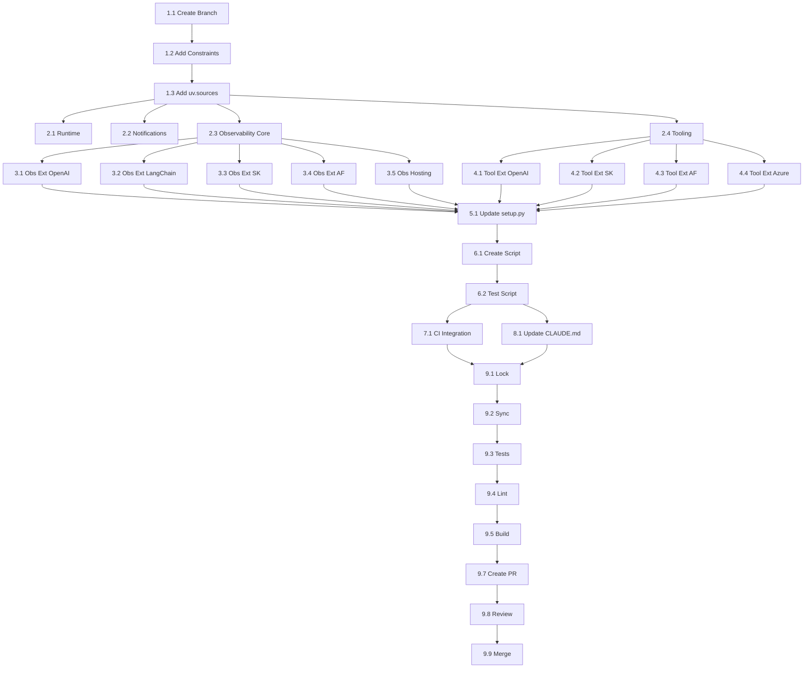

# Task Breakdown: Centralized Package Version Constraints

**Parent PRD:** [PRD-CentralizedPackageVersions.md](../PRD-CentralizedPackageVersions.md)
**Created:** 2026-01-27
**Status:** Ready for Implementation

---

## Overview

This document breaks down the implementation of centralized package version constraints into discrete, actionable tasks. Each task includes acceptance criteria and estimated effort.

---

## Phase 1: Setup and Root Configuration

### Task 1.1: Create Feature Branch

**Description:** Create a feature branch from main for the centralized version constraints implementation.

**Steps:**
1. Ensure local main is up to date: `git checkout main && git pull`
2. Create feature branch: `git checkout -b feature/centralized-package-versions`

**Acceptance Criteria:**
- [ ] Feature branch created from latest main
- [ ] Branch name follows convention: `feature/centralized-package-versions`

**Effort:** 5 minutes

---

### Task 1.2: Add constraint-dependencies to Root pyproject.toml

**Description:** Add the `constraint-dependencies` array to the root `pyproject.toml` under `[tool.uv]`.

**File:** `pyproject.toml`

**Steps:**
1. Open root `pyproject.toml`
2. Locate the `[tool.uv]` section
3. Add `constraint-dependencies` array with all external package constraints
4. Organize alphabetically within categories
5. Add category comments for maintainability

**Constraints to Add:**
```toml
constraint-dependencies = [
    # --- Observability (OpenTelemetry) ---
    "opentelemetry-api >= 1.36.0",
    "opentelemetry-sdk >= 1.36.0",
    "opentelemetry-exporter-otlp >= 1.36.0",
    "opentelemetry-exporter-otlp-proto-grpc >= 1.36.0",
    "opentelemetry-instrumentation >= 0.47b0",

    # --- Azure Services ---
    "azure-ai-agents >= 1.0.0b251001",
    "azure-ai-projects >= 2.0.0b1",
    "azure-identity >= 1.12.0",
    "azure-monitor-ingestion >= 1.0.0",
    "azure-monitor-opentelemetry-exporter >= 1.0.0b39",

    # --- AI Frameworks ---
    "agent-framework-azure-ai >= 1.0.0b251114",
    "langchain >= 0.1.0",
    "langchain-core >= 0.1.0",
    "openai-agents >= 0.2.6",
    "semantic-kernel >= 1.0.0",

    # --- Microsoft Agents SDK ---
    "microsoft-agents-activity >= 0.4.0",
    "microsoft-agents-hosting-core >= 0.4.0",

    # --- Data Validation & Utilities ---
    "aiohttp >= 3.8.0",
    "asyncio-throttle >= 1.0.0",
    "pydantic >= 2.0.0",
    "PyJWT >= 2.8.0",
    "typing-extensions >= 4.0.0",

    # --- Development & Testing ---
    "black >= 23.0.0",
    "mypy >= 1.0.0",
    "openai >= 1.0.0",
    "pytest >= 7.0.0",
    "pytest-asyncio >= 0.21.0",
    "pytest-mock >= 3.10.0",
    "python-dotenv >= 1.0.0",
    "ruff >= 0.1.0",
]
```

**Acceptance Criteria:**
- [ ] `constraint-dependencies` array added to `[tool.uv]` section
- [ ] All external dependencies from all 13 packages are included
- [ ] Constraints organized by category with comments
- [ ] Packages alphabetized within each category

**Effort:** 30 minutes

---

### Task 1.3: Add All Internal Packages to [tool.uv.sources]

**Description:** Ensure all internal packages are listed in `[tool.uv.sources]` with `{ workspace = true }` so uv uses local packages during development.

**File:** `pyproject.toml`

**Steps:**
1. Locate the `[tool.uv.sources]` section
2. Add any missing internal packages with `{ workspace = true }`

**Current state has some packages, ensure ALL are present:**
```toml
[tool.uv.sources]
microsoft-agents-a365-notifications = { workspace = true }
microsoft-agents-a365-observability-core = { workspace = true }
microsoft-agents-a365-observability-extensions-openai = { workspace = true }
microsoft-agents-a365-observability-extensions-langchain = { workspace = true }
microsoft-agents-a365-observability-extensions-semantickernel = { workspace = true }
microsoft-agents-a365-observability-extensions-agentframework = { workspace = true }
microsoft-agents-a365-observability-hosting = { workspace = true }
microsoft-agents-a365-runtime = { workspace = true }
microsoft-agents-a365-tooling = { workspace = true }
microsoft-agents-a365-tooling-extensions-openai = { workspace = true }
microsoft-agents-a365-tooling-extensions-semantickernel = { workspace = true }
microsoft-agents-a365-tooling-extensions-agentframework = { workspace = true }
microsoft-agents-a365-tooling-extensions-azureaifoundry = { workspace = true }
```

**Acceptance Criteria:**
- [ ] All 13 internal packages listed in `[tool.uv.sources]`
- [ ] Each has `{ workspace = true }` value
- [ ] Packages listed alphabetically

**Effort:** 10 minutes

---

## Phase 2: Core Package Migration

### Task 2.1: Update microsoft-agents-a365-runtime

**Description:** Remove version constraints from dependencies in the runtime package.

**File:** `libraries/microsoft-agents-a365-runtime/pyproject.toml`

**Changes:**
| Section | Before | After |
|---------|--------|-------|
| dependencies | `"PyJWT >= 2.8.0"` | `"PyJWT"` |
| dev | `"pytest >= 7.0.0"` | `"pytest"` |
| dev | `"pytest-asyncio >= 0.21.0"` | `"pytest-asyncio"` |
| dev | `"ruff >= 0.1.0"` | `"ruff"` |
| dev | `"black >= 23.0.0"` | `"black"` |
| dev | `"mypy >= 1.0.0"` | `"mypy"` |
| test | `"pytest >= 7.0.0"` | `"pytest"` |
| test | `"pytest-asyncio >= 0.21.0"` | `"pytest-asyncio"` |

**Preserve unchanged:**
- `[build-system]` requires
- Internal workspace dependencies (none in this package)

**Acceptance Criteria:**
- [ ] All external dependency version constraints removed
- [ ] Package names retained
- [ ] build-system unchanged

**Effort:** 10 minutes

---

### Task 2.2: Update microsoft-agents-a365-notifications

**Description:** Remove version constraints from dependencies in the notifications package.

**File:** `libraries/microsoft-agents-a365-notifications/pyproject.toml`

**Changes:**
| Section | Before | After |
|---------|--------|-------|
| dependencies | `"typing-extensions >= 4.0.0"` | `"typing-extensions"` |
| dependencies | `"microsoft-agents-activity>=0.4.0"` | `"microsoft-agents-activity"` |
| dependencies | `"microsoft-agents-hosting-core>=0.4.0"` | `"microsoft-agents-hosting-core"` |
| dependencies | `"pydantic>=2.0.0"` | `"pydantic"` |
| dev | (all dev deps) | (remove versions) |
| test | (all test deps) | (remove versions) |

**Note:** External deps like `microsoft-agents-activity` and `microsoft-agents-hosting-core` should have versions removed too - they will be resolved via `constraint-dependencies`.

**Acceptance Criteria:**
- [ ] All external dependency version constraints removed
- [ ] Package names retained
- [ ] build-system unchanged

**Effort:** 10 minutes

---

### Task 2.3: Update microsoft-agents-a365-observability-core

**Description:** Remove version constraints from dependencies in the observability-core package.

**File:** `libraries/microsoft-agents-a365-observability-core/pyproject.toml`

**Changes:**
| Section | Before | After |
|---------|--------|-------|
| dependencies | `"opentelemetry-api >= 1.36.0"` | `"opentelemetry-api"` |
| dependencies | `"opentelemetry-sdk >= 1.36.0"` | `"opentelemetry-sdk"` |
| dependencies | `"opentelemetry-exporter-otlp >= 1.36.0"` | `"opentelemetry-exporter-otlp"` |
| dependencies | `"pydantic >= 2.0.0"` | `"pydantic"` |
| dependencies | `"typing-extensions >= 4.0.0"` | `"typing-extensions"` |
| azure | `"azure-monitor-opentelemetry-exporter >= 1.0.0b39"` | `"azure-monitor-opentelemetry-exporter"` |
| azure | `"azure-identity >= 1.12.0"` | `"azure-identity"` |
| azure | `"azure-monitor-ingestion >= 1.0.0"` | `"azure-monitor-ingestion"` |
| jaeger | `"opentelemetry-exporter-otlp-proto-grpc >= 1.36.0"` | `"opentelemetry-exporter-otlp-proto-grpc"` |
| dev | (all dev deps) | (remove versions) |
| test | (all test deps) | (remove versions) |

**Also update internal dependency:**
| Section | Before | After |
|---------|--------|-------|
| dependencies | `"microsoft-agents-a365-runtime >= 0.0.0"` | `"microsoft-agents-a365-runtime"` |

**Acceptance Criteria:**
- [ ] All external dependency version constraints removed
- [ ] Internal workspace dependency version placeholder removed (name only)
- [ ] Optional dependencies (azure, jaeger) updated
- [ ] build-system unchanged

**Effort:** 15 minutes

---

### Task 2.4: Update microsoft-agents-a365-tooling

**Description:** Remove version constraints from dependencies in the tooling package.

**File:** `libraries/microsoft-agents-a365-tooling/pyproject.toml`

**Changes:**
- Remove version constraints from all external dependencies
- Remove version placeholders from internal dependencies (keep name only)

**Acceptance Criteria:**
- [ ] All external dependency version constraints removed
- [ ] Internal workspace dependency version placeholders removed (name only)
- [ ] build-system unchanged

**Effort:** 10 minutes

---

## Phase 3: Observability Extensions Migration

### Task 3.1: Update microsoft-agents-a365-observability-extensions-openai

**File:** `libraries/microsoft-agents-a365-observability-extensions-openai/pyproject.toml`

**Changes:**
- Remove version constraints from: `openai-agents`, `opentelemetry-api`, `opentelemetry-sdk`, `opentelemetry-instrumentation`
- Remove version constraints from dev/test dependencies
- Remove version placeholders from internal workspace dependencies (keep name only)

**Acceptance Criteria:**
- [ ] All external dependency version constraints removed
- [ ] Internal workspace dependency version placeholders removed (name only)

**Effort:** 10 minutes

---

### Task 3.2: Update microsoft-agents-a365-observability-extensions-langchain

**File:** `libraries/microsoft-agents-a365-observability-extensions-langchain/pyproject.toml`

**Changes:**
- Remove version constraints from: `langchain`, `langchain-core`, `opentelemetry-api`, `opentelemetry-sdk`, `opentelemetry-instrumentation`
- Remove version constraints from dev/test dependencies
- Remove version placeholders from internal workspace dependencies (keep name only)

**Acceptance Criteria:**
- [ ] All external dependency version constraints removed
- [ ] Internal workspace dependency version placeholders removed (name only)

**Effort:** 10 minutes

---

### Task 3.3: Update microsoft-agents-a365-observability-extensions-semantickernel

**File:** `libraries/microsoft-agents-a365-observability-extensions-semantickernel/pyproject.toml`

**Changes:**
- Remove version constraints from: `semantic-kernel`, `opentelemetry-api`, `opentelemetry-sdk`, `opentelemetry-instrumentation`
- Remove version constraints from dev/test dependencies
- Remove version placeholders from internal workspace dependencies (keep name only)

**Acceptance Criteria:**
- [ ] All external dependency version constraints removed
- [ ] Internal workspace dependency version placeholders removed (name only)

**Effort:** 10 minutes

---

### Task 3.4: Update microsoft-agents-a365-observability-extensions-agentframework

**File:** `libraries/microsoft-agents-a365-observability-extensions-agentframework/pyproject.toml`

**Changes:**
- Remove version constraints from: `opentelemetry-api`, `opentelemetry-sdk`, `opentelemetry-instrumentation`
- Remove version constraints from dev/test dependencies
- Remove version placeholders from internal workspace dependencies (keep name only)

**Acceptance Criteria:**
- [ ] All external dependency version constraints removed
- [ ] Internal workspace dependency version placeholders removed (name only)

**Effort:** 10 minutes

---

### Task 3.5: Update microsoft-agents-a365-observability-hosting

**File:** `libraries/microsoft-agents-a365-observability-hosting/pyproject.toml`

**Changes:**
- Remove version constraints from: `opentelemetry-api`, `microsoft-agents-hosting-core`
- Remove version constraints from dev/test dependencies
- Remove version placeholders from internal workspace dependencies (keep name only)

**Acceptance Criteria:**
- [ ] All external dependency version constraints removed
- [ ] Internal workspace dependency version placeholders removed (name only)

**Effort:** 10 minutes

---

## Phase 4: Tooling Extensions Migration

### Task 4.1: Update microsoft-agents-a365-tooling-extensions-openai

**File:** `libraries/microsoft-agents-a365-tooling-extensions-openai/pyproject.toml`

**Changes:**
- Remove version constraints from: `openai-agents`, `asyncio-throttle`
- Remove version constraints from dev/test dependencies
- Remove version placeholders from internal workspace dependencies (keep name only)

**Acceptance Criteria:**
- [ ] All external dependency version constraints removed
- [ ] Internal workspace dependency version placeholders removed (name only)

**Effort:** 10 minutes

---

### Task 4.2: Update microsoft-agents-a365-tooling-extensions-semantickernel

**File:** `libraries/microsoft-agents-a365-tooling-extensions-semantickernel/pyproject.toml`

**Changes:**
- Remove version constraints from: `semantic-kernel`, `aiohttp`
- Remove version constraints from dev/test dependencies
- Remove version placeholders from internal workspace dependencies (keep name only)

**Acceptance Criteria:**
- [ ] All external dependency version constraints removed
- [ ] Internal workspace dependency version placeholders removed (name only)

**Effort:** 10 minutes

---

### Task 4.3: Update microsoft-agents-a365-tooling-extensions-agentframework

**File:** `libraries/microsoft-agents-a365-tooling-extensions-agentframework/pyproject.toml`

**Changes:**
- Remove version constraints from: `microsoft-agents-hosting-core`, `agent-framework-azure-ai`, `azure-identity`, `typing-extensions`
- Remove version constraints from dev/test dependencies
- Remove version placeholders from internal workspace dependencies (keep name only)

**Acceptance Criteria:**
- [ ] All external dependency version constraints removed
- [ ] Internal workspace dependency version placeholders removed (name only)

**Effort:** 10 minutes

---

### Task 4.4: Update microsoft-agents-a365-tooling-extensions-azureaifoundry

**File:** `libraries/microsoft-agents-a365-tooling-extensions-azureaifoundry/pyproject.toml`

**Changes:**
- Remove version constraints from: `azure-ai-projects`, `azure-ai-agents`, `azure-identity`
- Remove version constraints from dev/test dependencies
- Remove version placeholders from internal workspace dependencies (keep name only)

**Acceptance Criteria:**
- [ ] All external dependency version constraints removed
- [ ] Internal workspace dependency version placeholders removed (name only)

**Effort:** 10 minutes

---

## Phase 5: Setup.py Exact Version Matching

### Task 5.1: Update All Package setup.py Files

**Description:** Update all 13 package `setup.py` files to use `use_exact_match=True` so that published packages require exact version matches of internal dependencies.

**Files to modify:**
- `libraries/microsoft-agents-a365-runtime/setup.py`
- `libraries/microsoft-agents-a365-notifications/setup.py`
- `libraries/microsoft-agents-a365-observability-core/setup.py`
- `libraries/microsoft-agents-a365-observability-extensions-openai/setup.py`
- `libraries/microsoft-agents-a365-observability-extensions-langchain/setup.py`
- `libraries/microsoft-agents-a365-observability-extensions-semantickernel/setup.py`
- `libraries/microsoft-agents-a365-observability-extensions-agentframework/setup.py`
- `libraries/microsoft-agents-a365-observability-hosting/setup.py`
- `libraries/microsoft-agents-a365-tooling/setup.py`
- `libraries/microsoft-agents-a365-tooling-extensions-openai/setup.py`
- `libraries/microsoft-agents-a365-tooling-extensions-semantickernel/setup.py`
- `libraries/microsoft-agents-a365-tooling-extensions-agentframework/setup.py`
- `libraries/microsoft-agents-a365-tooling-extensions-azureaifoundry/setup.py`

**Change in each file:**

Before:
```python
setup(
    version=package_version,
    install_requires=get_dynamic_dependencies(
        use_compatible_release=False,
        use_exact_match=False,
    ),
)
```

After:
```python
setup(
    version=package_version,
    install_requires=get_dynamic_dependencies(
        use_exact_match=True,
    ),
)
```

**Why this matters:**
- When building package A v1.2.3, internal deps will be `microsoft-agents-a365-runtime == 1.2.3`
- This ensures all SDK packages must be at the same version
- Prevents incompatibility issues from version mismatches

**Acceptance Criteria:**
- [ ] All 13 `setup.py` files updated
- [ ] `use_exact_match=True` set in each file
- [ ] Removed `use_compatible_release=False` (no longer needed)

**Effort:** 20 minutes

---

## Phase 6: Verification Script

### Task 6.1: Create Verification Script

**Description:** Create a Python script that verifies centralized version constraints are properly configured.

**File:** `scripts/verify_constraints.py`

**Requirements:**
1. Parse root `pyproject.toml` to extract `constraint-dependencies`
2. Parse all package `pyproject.toml` files
3. Check that no dependencies (external OR internal) have version constraints
4. Check that all external dependencies have constraints in root
5. Check that all internal dependencies are in `[tool.uv.sources]`
6. Output clear pass/fail status with details

**Script Structure:**
```python
#!/usr/bin/env python3
# Copyright (c) Microsoft Corporation.
# Licensed under the MIT License.

"""
Verify centralized version constraints are properly configured.

This script ensures:
1. No external dependencies in package pyproject.toml files have version constraints
2. All external dependencies have constraints defined in root pyproject.toml
"""

import re
import sys
from pathlib import Path

# Implementation details...

if __name__ == "__main__":
    sys.exit(main())
```

**Acceptance Criteria:**
- [ ] Script created at `scripts/verify_constraints.py`
- [ ] Script has required copyright header
- [ ] Script detects version constraints in package files (both external and internal)
- [ ] Script detects missing constraints in root for external deps
- [ ] Script verifies internal deps are in `[tool.uv.sources]`
- [ ] Script exits with code 0 on success, non-zero on failure
- [ ] Script output is clear and actionable

**Effort:** 2 hours

---

### Task 6.2: Test Verification Script

**Description:** Test the verification script against the migrated codebase.

**Steps:**
1. Run script: `python scripts/verify_constraints.py`
2. Verify it passes on correctly migrated files
3. Temporarily add a version constraint to a package file
4. Verify script detects the violation
5. Remove the test violation

**Acceptance Criteria:**
- [ ] Script passes on correctly configured codebase
- [ ] Script fails when version constraint is added to package file
- [ ] Error messages are clear and include file paths

**Effort:** 30 minutes

---

## Phase 7: CI Integration

### Task 7.1: Add Verification to CI Workflow

**Description:** Add the verification script as an early step in the CI pipeline.

**File:** `.github/workflows/ci.yml`

**Changes:**
Add a new step after checkout, before lint checks:

```yaml
- name: Verify centralized version constraints
  run: python scripts/verify_constraints.py
```

**Acceptance Criteria:**
- [ ] Verification step added to CI workflow
- [ ] Step runs before lint/test steps
- [ ] CI fails if verification fails

**Effort:** 15 minutes

---

## Phase 8: Documentation

### Task 8.1: Update CLAUDE.md

**Description:** Add documentation for the centralized version management pattern.

**File:** `CLAUDE.md`

**Location:** Add new section under "Architecture"

**Content to Add:**
```markdown
### Centralized Dependency Version Management

This monorepo uses uv's `constraint-dependencies` feature to centralize version constraints:

**How it works:**
1. **Root pyproject.toml** defines version constraints for all external packages
2. **Package pyproject.toml** files declare dependencies by name only (no version)
3. **uv** applies root constraints during dependency resolution

**Adding a new dependency:**
1. Add the package name to your package's `dependencies` array
2. Add the version constraint to root `pyproject.toml` `constraint-dependencies`
3. Run `uv lock && uv sync`

**Updating a dependency version:**
1. Edit the constraint in root `pyproject.toml` only
2. Run `uv lock && uv sync`
3. All packages automatically use the new version

**Important:** Internal workspace dependencies (e.g., `microsoft-agents-a365-runtime >= 0.0.0`)
keep their version specifiers - these are build-time placeholders, not actual constraints.

**CI Enforcement:** The `scripts/verify_constraints.py` script runs in CI to prevent
accidental reintroduction of version constraints in package files.
```

**Acceptance Criteria:**
- [ ] New section added to CLAUDE.md
- [ ] Documentation explains how the pattern works
- [ ] Documentation includes instructions for adding/updating dependencies
- [ ] Documentation mentions CI enforcement

**Effort:** 20 minutes

---

## Phase 9: Validation and Finalization

### Task 9.1: Regenerate Lock File

**Description:** Regenerate the uv lock file with the new configuration.

**Command:** `uv lock`

**Acceptance Criteria:**
- [ ] `uv lock` completes successfully
- [ ] No resolution errors
- [ ] Lock file updated

**Effort:** 5 minutes

---

### Task 9.2: Sync Dependencies

**Description:** Sync all dependencies to verify installation works.

**Command:** `uv sync --all-extras --dev`

**Acceptance Criteria:**
- [ ] `uv sync` completes successfully
- [ ] All packages installed correctly

**Effort:** 5 minutes

---

### Task 9.3: Run Unit Tests

**Description:** Run all unit tests to verify no regressions.

**Command:** `uv run --frozen pytest tests/ -v --tb=short -m "not integration"`

**Acceptance Criteria:**
- [ ] All unit tests pass
- [ ] No new test failures

**Effort:** 10 minutes

---

### Task 9.4: Run Lint Checks

**Description:** Run linting to verify code quality.

**Commands:**
```bash
uv run --frozen ruff check .
uv run --frozen ruff format --check .
```

**Acceptance Criteria:**
- [ ] No lint errors
- [ ] No format differences

**Effort:** 5 minutes

---

### Task 9.5: Run Build

**Description:** Build all packages to verify build succeeds.

**Command:**
```bash
export AGENT365_PYTHON_SDK_PACKAGE_VERSION="0.2.1"
uv build --all-packages --wheel
```

**Acceptance Criteria:**
- [ ] All 13 packages build successfully
- [ ] Wheels created in `dist/`

**Effort:** 10 minutes

---

### Task 9.6: Compare Lock Files (Optional Verification)

**Description:** Compare lock file before and after to verify no unexpected version changes.

**Steps:**
1. Save copy of original lock file before changes
2. Compare with new lock file after changes
3. Verify only expected differences (if any)

**Acceptance Criteria:**
- [ ] No unexpected version changes
- [ ] Any differences are understood and acceptable

**Effort:** 15 minutes

---

### Task 9.7: Create Pull Request

**Description:** Create a pull request with all changes.

**Steps:**
1. Stage all changes: `git add -A`
2. Commit: `git commit -m "feat: Centralize package version constraints using uv constraint-dependencies"`
3. Push: `git push -u origin feature/centralized-package-versions`
4. Create PR via GitHub

**PR Description Template:**
```markdown
## Summary
Centralizes all external dependency version constraints in the root `pyproject.toml` using uv's `constraint-dependencies` feature.

## Changes
- Added `constraint-dependencies` to root pyproject.toml with all external package constraints
- Added all internal packages to `[tool.uv.sources]` with `{ workspace = true }`
- Removed version constraints from all 13 package pyproject.toml files (including internal deps)
- Updated all 13 `setup.py` files to use `use_exact_match=True` for internal dependencies
- Created `scripts/verify_constraints.py` to prevent regression
- Added verification step to CI workflow
- Updated CLAUDE.md with documentation

## Benefits
- Single location for version updates (external deps)
- Ensures consistency across all packages
- Published packages require exact version matches of internal deps (e.g., `== 1.2.3`)
- Reduces merge conflicts
- Easier security audits

## Testing
- [ ] `uv lock` succeeds
- [ ] `uv sync --all-extras --dev` succeeds
- [ ] All unit tests pass
- [ ] All lint checks pass
- [ ] All packages build successfully
- [ ] Verification script passes
- [ ] Built wheels show exact version for internal deps (inspect with `unzip -p dist/*.whl '*.dist-info/METADATA'`)

## Documentation
- CLAUDE.md updated with centralized version management documentation
```

**Acceptance Criteria:**
- [ ] All files committed
- [ ] PR created with descriptive title and body
- [ ] CI pipeline triggered

**Effort:** 15 minutes

---

### Task 9.8: Address Review Feedback

**Description:** Address any feedback from code review.

**Acceptance Criteria:**
- [ ] All review comments addressed
- [ ] Changes committed and pushed
- [ ] CI passes after updates

**Effort:** Variable (depends on feedback)

---

### Task 9.9: Merge to Main

**Description:** Merge the PR after approval.

**Acceptance Criteria:**
- [ ] PR approved
- [ ] CI passes
- [ ] PR merged to main
- [ ] Feature branch deleted

**Effort:** 5 minutes

---

## Summary

| Phase | Tasks | Estimated Effort |
|-------|-------|------------------|
| 1. Setup and Root Configuration | 3 | 45 minutes |
| 2. Core Package Migration | 4 | 45 minutes |
| 3. Observability Extensions Migration | 5 | 50 minutes |
| 4. Tooling Extensions Migration | 4 | 40 minutes |
| 5. Setup.py Exact Version Matching | 1 | 20 minutes |
| 6. Verification Script | 2 | 2.5 hours |
| 7. CI Integration | 1 | 15 minutes |
| 8. Documentation | 1 | 20 minutes |
| 9. Validation and Finalization | 9 | ~1 hour |

**Total Estimated Effort:** ~6.5 hours

---

## Dependencies Between Tasks



---

## Checklist for Implementation

### Pre-Implementation
- [ ] Read and understand the PRD
- [ ] Review current state of all pyproject.toml files
- [ ] Ensure uv >= 0.4.0 is installed

### Implementation
- [ ] Phase 1: Setup and Root Configuration (3 tasks)
- [ ] Phase 2: Core Package Migration (4 tasks)
- [ ] Phase 3: Observability Extensions Migration (5 tasks)
- [ ] Phase 4: Tooling Extensions Migration (4 tasks)
- [ ] Phase 5: Setup.py Exact Version Matching (1 task)
- [ ] Phase 6: Verification Script (2 tasks)
- [ ] Phase 7: CI Integration (1 task)
- [ ] Phase 8: Documentation (1 task)
- [ ] Phase 9: Validation and Finalization (9 tasks)

### Post-Implementation
- [ ] Monitor CI for any issues
- [ ] Communicate change to team
- [ ] Update any related documentation if needed
